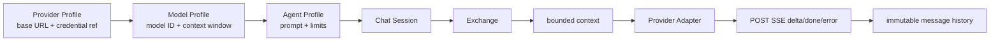

# Local Provider / Agent / Chat Runtime

ADR-0022 implements the Provider → Model → Agent → Session/Message → `POST + SSE` system described by the six Provider/Skill/Agent/Chat PDFs. It is separate from the existing Product Task/Run control plane and from ADR-0021's deterministic Agent Lab.

## Runtime objects

- **Provider Profile** stores only a protocol type, base URL and optional `keychain://harnessagent/<name>` reference. It never stores a token or secret.
- **Model Profile** is an explicit local mapping; no remote model list is fetched.
- **Agent Profile** holds identity, system prompt and bounds. It has exactly zero Tool/MCP/Skill bindings in this milestone.
- **Session** is a local ordered history. **Exchange** records one idempotent send attempt and whether it was queued, streaming, successful, failed or cancelled.

## External-call gate

No external Provider call occurs by default. A call can only be attempted when all conditions are true:

1. `HARNESS_AGENT_RUNTIME=enabled` is set at process start;
2. Provider, Model and Agent Profiles are enabled;
3. the Provider protocol has an implemented adapter;
4. a valid credential reference exists; and
5. Keychain resolves it at the final transport boundary.

The current default deployment intentionally fails the message Exchange with `MODEL_RUNTIME_DISABLED`; it persists the user message and structured failure but **does not fabricate an assistant reply**. `GET .../providers/{id}/readiness` is a zero-network readiness explanation, not a health probe.

OpenAI-compatible Chat Completions SSE is implemented as a protocol adapter. Anthropic and Ollama Profiles may be documented but return `PROVIDER_ADAPTER_NOT_IMPLEMENTED` until their separate adapter work is accepted. There is no fallback.

## Context, streaming and cancellation

The provider request is assembled from one system prompt and the most recent `2 × max_context_turns` persisted user/assistant messages. The complete provider output is persisted as an assistant message only after a successful stream. A model error, credential error, empty response or cancellation never becomes a synthetic assistant answer.

Browsers use `fetch` with `POST` and parse SSE `delta`, `done` and `error` events. `AbortController` stops browser display; the persisted Exchange remains auditable and is transitioned to cancellation only when the upstream connection is actually interrupted.

## API

All endpoints live below `/api/local/agent-runtime` and require `Idempotency-Key` on writes:

- `GET/POST /providers`; `GET /providers/{providerId}/readiness`
- `GET/POST /models`; `GET/POST /agents`
- `GET/POST /sessions`; `GET /sessions/{sessionId}`
- `POST /sessions/{sessionId}/messages` with `Accept: text/event-stream`

Machine contracts: [`agent-runtime.schema.json`](../../specs/v1/agent-runtime.schema.json). OpenAPI documents the same stream separately from Agent Lab.

## Explicit non-goals

There is no Tool/MCP/Skill execution, Agent Loop, ReAct, Child Run, RAG, long-term memory, remote model discovery or Provider health request. The runtime does not read or write Product Task, Run, Plan, Evidence, Gap or Checkpoint state.
