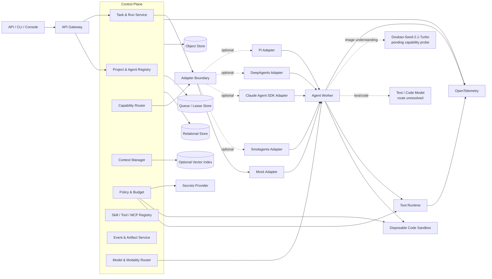
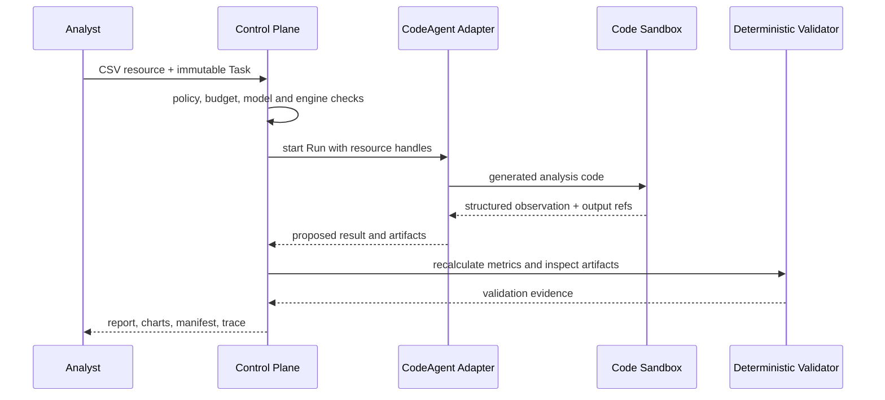

# 目标架构

本页描述完整目标。已经部署的本地 v0.1 采用 ADR-0009 的精简实现，实际数据流见 [现状架构](CURRENT_ARCHITECTURE.md)，使用方式见 [本地工作台](LOCAL_WORKBENCH.md)。

## 架构原则

- 控制面只保存 Agent 工程元数据和执行状态，不成为具体业务系统的事实源。
- 核心契约与执行引擎解耦；适配器负责协议翻译和能力声明。
- 工具执行与模型推理隔离；所有副作用在执行前经过策略判断。
- 状态先持久化，再发布事件；关键操作使用幂等键和 Outbox。
- 追踪、成本、权限、证据是主流程能力，不是事后补丁。

## 逻辑架构



## 主要组件

| 组件 | 职责 | 不承担 |
|---|---|---|
| API Gateway | 鉴权、限流、幂等、版本协商 | 任务编排 |
| Task & Run Service | 不可变 Task、Run 状态机、租约、重试、取消、检查点 | 引擎私有逻辑 |
| Capability Router | 按声明匹配并解释选择 | 运行中静默切换 |
| Context Manager | 上下文装配、摘要、引用与预算 | 永久存储全部原始 Prompt |
| Policy & Budget | 权限、审批、配额、成本截止 | 执行具体工具 |
| Adapter Boundary | 统一开始、恢复、取消、事件和结果 | 核心产品规则 |
| Tool Runtime | Schema 校验、隔离、超时、审计 | 自行提升权限 |
| Event & Artifact | 事件流、产物、引用、Evidence | 修改历史事件 |
| Model Router | 按模态、数据策略和预算解析固定部署 | 运行中静默换模型 |
| Code Sandbox | 执行模型生成代码并限制文件、网络和资源 | 保存平台长期凭证 |

## 标准执行循环

```text
load Run checkpoint → build bounded context → call engine
→ receive code/tool proposal → validate and authorize
→ execute code in disposable sandbox or call Tool Runtime
→ persist observation/event/checkpoint → continue or exit
```

标准退出原因包括：完成、达到轮次上限、取消、超时、权限拒绝、预算耗尽、沙箱违规和不可恢复工具错误。适配器必须映射为平台统一 Run 终态或等待状态。

## P0 数据分析链路



P0 基线默认无网络、无 Child Run、无外部写入，也不发送图片。HA-0005 通过后，P0.1 才在输入含截图/扫描件或显式图表解读时调用用户指定图片路由，见 [MODEL_ROUTING.md](MODEL_ROUTING.md)。

## 多框架演进

框架融合发生在契约层，不发生在运行时嵌套层：P0 只验证 Smolagents CodeAct；Claude Agent SDK 的 Skills/研报与复杂编排进入 P1；Deep Agents 动态知识工作区和 Pi TypeScript 合同审查进入 P2。每个阶段都复用同一 Task/Run、Policy、Tool、Event、Artifact 和 Evaluation 边界，详细责任与准入证据见 [FRAMEWORK_INTEGRATION.md](FRAMEWORK_INTEGRATION.md)。

## 数据流约束

1. 接收请求后先创建不可变 Task 与初始 Run，再投递执行消息。
2. Worker 通过租约领取 Run，同一 Run 同时只能有一个有效写入者。
3. 模型请求只获得本次所需的最小上下文和短期凭证引用。
4. 工具调用请求先落审计，再判断策略；批准后生成一次性执行令牌。
5. 事件仅追加；产物使用内容摘要和不可变版本关联。
6. 适配器只能提出结果；验证通过后，控制面写 Run 终态、结果摘要和 Evidence 索引，再发布终态事件。

## 部署边界

- 控制面、Python Worker、Node Worker、代码沙箱和可观测后端可独立部署。
- 适配器与 Worker 技术栈匹配，通过内部协议与控制面通信。
- 外部模型、MCP 服务和存储均视为不可信边界，设置超时、最小权限与审计。

仓库中的 `harness/` 只管理研发过程和证据；它不会在生产请求路径中执行。

领域生命周期见 [CORE_CONTRACTS.md](CORE_CONTRACTS.md)，引擎边界见 [ADAPTER_CONTRACT.md](ADAPTER_CONTRACT.md)，沙箱边界见 [TOOL_AND_SANDBOX.md](TOOL_AND_SANDBOX.md)。
