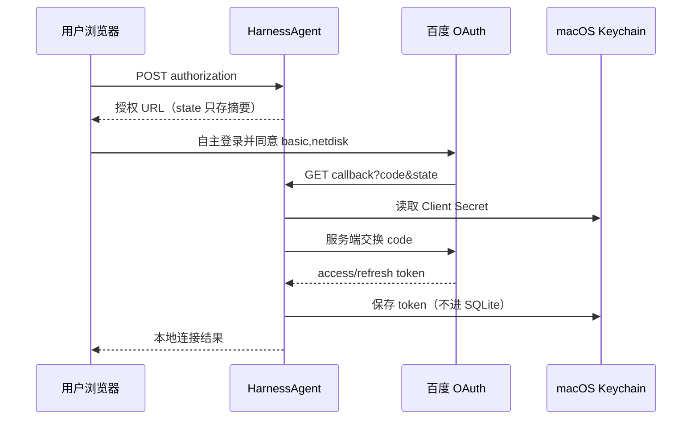

# 百度网盘 OAuth 连接器（本地）

状态：HA-0010 本地连接底座已验收；真实 OAuth 连通等待用户创建官方应用并在本机自行授权。该连接器只使用百度官方 OAuth 授权码流程；不是百度网盘客户端替代品，也不下载任意公开分享链接。

## 能力与边界

已计划的第一切片：生成授权 URL、校验一次性 state、接收本机回调、令牌交换/刷新、在 macOS Keychain 保存令牌、状态查询和显式断开。数据面能力（列目录、下载、预览、分享文件）暂不启用。

禁止项：复用浏览器 Cookie、模拟登录、处理验证码、绕过会员/限速/访问控制、从分享链接推断私人文件，或向模型暴露 token 和原始 OAuth 响应。

## 用户准备

1. 在[百度网盘开放平台](https://yun.baidu.com/open/platform)创建应用并开通网盘授权能力。
2. 在应用后台登记回调地址：`http://127.0.0.1:8765/api/local/connectors/baidu-netdisk/callback`。地址必须与授权和换 token 时完全一致。
3. 在本机启动服务的环境中设置公开配置，不要在群聊发送 Secret：

```sh
export HARNESS_BAIDUPAN_CLIENT_ID='你的 App Key'
```

回调地址由连接器固定为上文的 `127.0.0.1` 地址，不能用环境变量覆盖；应用后台、授权请求和换 token 请求必须完全一致。

4. 通过 Keychain Access 为服务 `HarnessAgent.BaiduNetdisk` 创建账户 `oauth-client-secret` 的 Client Secret；真实授权后，服务会创建账户 `oauth-token:default`。不得把它们写进 `config.toml`、launchd plist、`.env`、源码或 Evidence。

## 流程



授权 state 10 分钟有效、单次使用；取消、过期、授权拒绝和 token 交换失败均写入无密的连接审计摘要。服务仅对官方固定 HTTPS host 发请求，10 秒超时，不自动重试令牌交换。

## 验收与非目标

测试已覆盖配置缺失、state 重放/过期/错配、用户拒绝授权、OAuth 错误、令牌结构错误、Keychain 写入失败、刷新、显式断开和所有输出的脱敏；详情见 `harness/evidence/HA-0010/manifest.json`。真实连通测试须使用独立测试账号和非敏感文件，并确认 Client ID、回调、scope 和应用状态；不得把真实 token 归档到测试报告。

官方材料：[OAuth 接入指南](https://openauth.baidu.com/doc/doc.html)、[百度网盘开放平台](https://yun.baidu.com/open/platform)，核验日期 2026-09-13。
