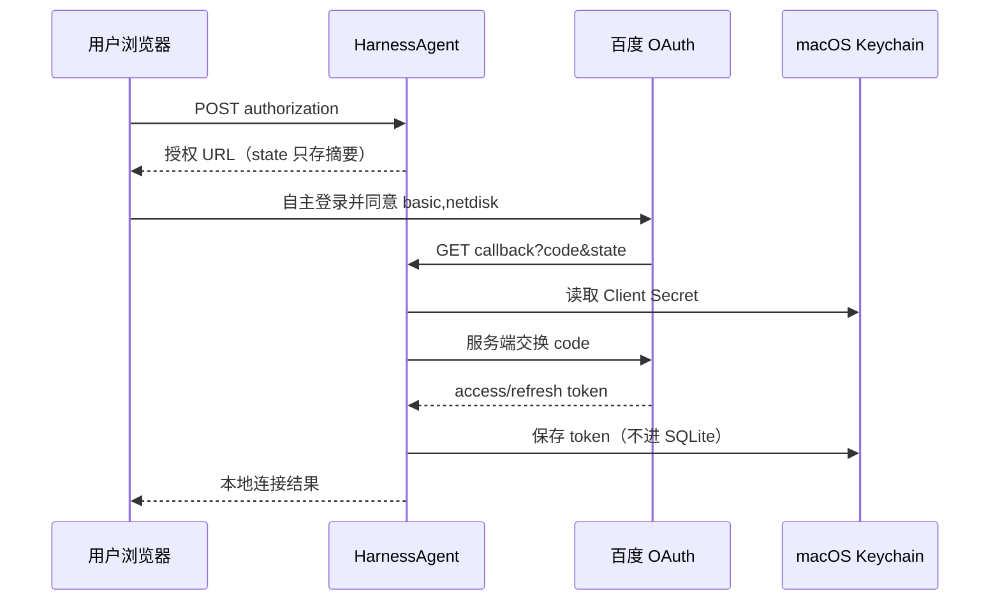

# 百度网盘 OAuth 连接器（本地）

状态：HA-0010 本地连接底座及 HA-0011 真实 OAuth 连通已验收；数据面仍关闭。该连接器只使用百度官方 OAuth 授权码流程；不是百度网盘客户端替代品，也不下载任意公开分享链接。

## 能力与边界

已计划的第一切片：生成授权 URL、校验一次性 state、接收本机回调、令牌交换/刷新、在 macOS Keychain 保存令牌、状态查询和显式断开。数据面能力（列目录、下载、预览、分享文件）暂不启用。

禁止项：复用浏览器 Cookie、模拟登录、处理验证码、绕过会员/限速/访问控制、从分享链接推断私人文件，或向模型暴露 token 和原始 OAuth 响应。

对于用户在当前聊天中明确提供的分享链接，另有 `skills/baidu-netdisk-download/`：它只将链接交给本机官方客户端，用户仍须自行完成下载。此交接不是 OAuth 数据面能力，不能用于列目录、直链下载或导入分享文件；详细边界见 [Skill 执行边界](SKILL_EXECUTION.md)。

## 用户准备

1. 在[百度网盘开放平台](https://yun.baidu.com/open/platform)创建应用并开通网盘授权能力。
2. 在应用后台登记回调地址：`http://127.0.0.1:8765/api/local/connectors/baidu-netdisk/callback`。地址必须与授权和换 token 时完全一致。
3. 在本机交互式终端运行配置助手；它会无回显读取 Client Secret、要求显式确认，随后将 Secret 写入 Keychain、将公开 App Key 注入当前登录会话的 launchd 环境并重启本地服务：

```sh
cd /Users/weberzhao/code/ai/harnessagent
.venv/bin/python harness/configure_baidu_netdisk.py
```

回调地址由连接器固定为上文的 `127.0.0.1` 地址，不能用环境变量覆盖；应用后台、授权请求和换 token 请求必须完全一致。助手不会接受 Secret 命令行参数、环境变量或文件输入，也不打开百度页面。

4. 打开本地连接页面，点击“生成官方授权链接”，在百度页面由本人登录并授权。真实授权后，服务会创建 Keychain 账户 `oauth-token:default`。不得把 Client Secret、token 写进 `config.toml`、launchd plist、`.env`、源码或 Evidence。

公开 App Key 在当前 macOS 登录会话有效；重新登录后可能须重新运行助手。若 Keychain 已有 Client Secret，重新运行会安全更新该条目。

## 流程



授权 state 10 分钟有效、单次使用；取消、过期、授权拒绝和 token 交换失败均写入无密的连接审计摘要。服务仅对官方固定 HTTPS host 直连发请求：禁用环境 HTTP(S)/SOCKS 代理、不跟随重定向、10 秒超时，且不自动重试令牌交换。

## 验收与非目标

测试已覆盖配置缺失、state 重放/过期/错配、用户拒绝授权、OAuth 错误、令牌结构错误、Keychain 写入失败、刷新、显式断开、直连 transport 和所有输出的脱敏；详情见 `harness/evidence/HA-0010/manifest.json`。真实 OAuth 连通和一次无数据面 refresh 的脱敏证据见 `harness/evidence/HA-0011/manifest.json`；不得把真实 token 归档到测试报告。数据面仍须单独使用独立测试账号、非敏感文件、最小 scope 和删除/审计证据验收。

官方材料：[OAuth 接入指南](https://openauth.baidu.com/doc/doc.html)、[百度网盘开放平台](https://yun.baidu.com/open/platform)，核验日期 2026-09-13。
