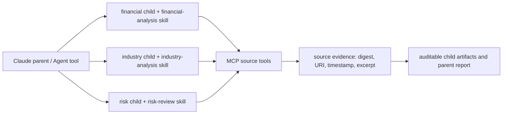

# Native Claude 投研运行时（ADR-0024，受控准入中）

`claude_native_research@1` 是 ADR-0023 模拟切片之后的真实执行适配器。它使用 Claude Agent SDK 的原生 `Agent` Tool 让父 Agent 分派财务、行业、风险三个 SubAgent；它不是 OpenAI-compatible 聊天运行时的替代，也不会从该运行时继承 Provider 配置。

## 固定拓扑

父 Agent 的唯一 built-in capability 是 `Agent`。三个 Child 的 `AgentDefinition` 固定为 `background=true` 和 `permissionMode=dontAsk`，没有 Bash、Read、Write、Edit、浏览器、任意 MCP 或用户/项目 Settings。资料能力只由本项目进程内 `research_sources` MCP Server 提供；父级 `allowed_tools`、角色级 AgentDefinition、SDK 的 `can_use_tool` 与工具服务的输入校验四层共同约束，但 OS 隔离仍是 TD-018，不能把它们误认为容器边界。`background=true` 表示请求 SDK 并发执行；只有 L3 的 delegation/timing trace 能证明一次运行实际并发。

## Skills 与工具

本地插件 `plugins/research-skills` 提供三个版本化 Skill。它们只规定工作步骤与不确定性表达：

| Child | Skill | 可用资料工具 |
|---|---|---|
| financial | `research-skills:financial-analysis` | `financial_data`、`pdf_extract`、`web_fetch` |
| industry | `research-skills:industry-analysis` | `web_search`、`web_fetch` |
| risk | `research-skills:risk-review` | `financial_data`、`web_search`、`web_fetch`、`pdf_extract` |

工具返回符合 `source_evidence`：稳定 ID、URI、获取时间、内容摘要、受限摘录。模型输出中的推断不等于事实；汇总器必须列出其证据 ID，任何没有证据的风险项标为“未评估”。本项目不提供投资建议。

## 启动门禁

默认没有任何模型、CLI、Keychain 或 HTTP 请求。要让运行时有资格启动，部署者必须在受控环境中同时配置：

1. `HARNESS_CLAUDE_RESEARCH_RUNTIME=enabled`；
2. `HARNESS_CLAUDE_RESEARCH_EXTERNAL_DATA=enabled`；
3. `HARNESS_CLAUDE_RESEARCH_MODEL=<批准的 Claude 模型 ID>`；
4. 非零、任务级 `max_cost_minor` 和 30–900 秒超时；
5. `HARNESS_CLAUDE_RESEARCH_ALLOWED_DOMAINS`：逗号分隔的精确小写域名；
6. 搜索/金融 API 的 HTTPS 端点和仅作 Keychain 查询键的引用（如该来源需要凭证）；
7. 输入 PDF 已登记、数据分类/外发范围经批准，且 CLI 身份已由部署者在本机完成，不向聊天或仓库提供秘密。

门禁未满足时返回稳定的 blocker 列表，不调用 `query()`，也不把模拟资料作为替代。`mcp==2.2.0` 仅通过静态构造探针；真实 SDK-MCP 连通、SubAgent 并发、工具取消和费用报告必须记录到本次运行的 Evidence 后才可把引擎标记 available。

取消任一 Child 会持久化取消整棵父/Child Run，并在下一次 SDK 事件写入前中断本地消费；这不是对远端 background SubAgent 已停止的证明。L3 必须记录 SDK/CLI transport 的实际取消结果。

## 已知限制

本阶段的代码可以构造真实 Claude query、原生 SubAgent 和进程内 MCP Server，但本机尚未提交批准的模型/数据源/金融 PDF 输入。因此当前状态仍是 **blocked by configuration and authorization**，不是“已跑通真实投研”。具体缺口见 TD-017、TD-018、TD-019、TD-025、TD-026。
