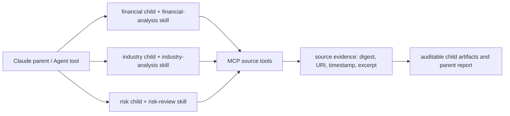

# Native Claude 投研运行时（ADR-0024，受控准入中）

HA-0076 新增持久化投影：SDK normalizer 输出是可能含正文的**内存观察**，不能
直接写日志。NativeResearch 先供 Child 聚合使用，再以 runtime-event-metadata@1
写入事件；Pi 观察同样投影。errors/structured_output 不复制到新事件，合法 Child
正文只通过既有 publish() 进入产物。旧事件不清理；详见 ADR-0076。此切片尚未
实现子进程环境白名单、独立目录、auto memory 控制或新的结构化汇总通道。

`claude_native_research@1` 是 ADR-0023 模拟切片之后的真实执行适配器。它使用 Claude Agent SDK 的原生 `Agent` Tool 让父 Agent 分派财务、行业、风险三个 SubAgent；它不是 OpenAI-compatible 聊天运行时的替代，也不会从该运行时继承 Provider 配置。

## 固定拓扑

```mermaid
flowchart LR
    P[Claude parent / Agent tool] --> F[financial child + financial-analysis skill]
    P --> I[industry child + industry-analysis skill]
    P --> R[risk child + risk-review skill]
    F --> M[MCP source tools]
    I --> M
    R --> M
    M --> E[source evidence: digest, URI, timestamp, excerpt]
    E --> A[auditable child artifacts and parent report]
```

父 Agent 的唯一 built-in capability 是 `Agent`。三个 Child 的 `AgentDefinition` 固定为 `background=true` 和 `permissionMode=dontAsk`，没有 Bash、Read、Write、Edit、浏览器、任意 MCP 或用户/项目 Settings。资料能力只由本项目进程内 `research_sources` MCP Server 提供；父级 `allowed_tools`、角色级 AgentDefinition、SDK 的 `can_use_tool` 与工具服务的输入校验四层共同约束，但 OS 隔离仍是 TD-018，不能把它们误认为容器边界。`background=true` 表示请求 SDK 并发执行；只有 L3 的 delegation/timing trace 能证明一次运行实际并发。

## Skills 与工具

本地插件 `plugins/research-skills` 提供三个版本化 Skill。它们只规定工作步骤与不确定性表达：

| Child | Skill | 可用资料工具 |
|---|---|---|
| financial | `research-skills:financial-analysis` | `financial_data`、`pdf_extract`、`web_fetch` |
| industry | `research-skills:industry-analysis` | `web_search`、`web_fetch` |
| risk | `research-skills:risk-review` | `financial_data`、`web_search`、`web_fetch`、`pdf_extract` |

工具返回符合 `source_evidence`：稳定 ID、URI、获取时间、内容摘要、受限摘录。模型输出中的推断不等于事实；汇总器必须列出其证据 ID，任何没有证据的风险项标为“未评估”。本项目不提供投资建议。

## 启动门禁

默认没有任何模型、CLI、Keychain 或 HTTP 请求。除了环境门禁，运行时还读取版本化 [`claude-research-admission@1`](../../harness/claude-research-admission.json) 档案；当前状态是 `not_admitted`。档案只可保存非秘密配置和 Evidence 引用，缺少任何一项时会把 `admission_not_approved` 加入 blocker，即使有人误设了环境变量也不会启动。

要让运行时有资格启动，部署者必须在受控环境中同时配置：

1. `HARNESS_CLAUDE_RESEARCH_RUNTIME=enabled`；
2. `HARNESS_CLAUDE_RESEARCH_EXTERNAL_DATA=enabled`；
3. `HARNESS_CLAUDE_RESEARCH_MODEL=<批准的 Claude 模型 ID>`；
4. 非零、任务级 `max_cost_minor` 和 30–900 秒超时；
5. `HARNESS_CLAUDE_RESEARCH_ALLOWED_DOMAINS`：逗号分隔的精确小写域名；
6. 搜索/金融 API 的 HTTPS 端点和仅作 Keychain 查询键的引用（如该来源需要凭证）；
7. 输入 PDF 已登记、数据分类/外发范围经批准，且 CLI 身份已由部署者在本机完成，不向聊天或仓库提供秘密。

同时，准入档案必须完整匹配运行配置：

| 准入字段 | 固定内容 | 运行时重核验 |
|---|---|---|
| Provider / 模型 | `claude_agent_sdk_cli`、精确 CLI path、批准模型 ID；Claude CLI 的登录状态不由 Harness 读取或保存 | CLI path 与模型必须完全一致 |
| 费用与时限 | USD `max_cost_minor`、`max_turns`、`timeout_seconds` | 请求只能等于或严于档案上限 |
| 资料源 | 精确域名，搜索与财务的 HTTPS endpoint；两者须符合当前 POST JSON connector 合同 | endpoint、域名、引用均须完全一致 |
| 凭据 | 仅 `keychain://harnessagent/<name>`；不存 token、Key 或密码 | 仅在获准 HTTP 工具的最后边界解析 |
| Public PDF | 文件名、SHA-256、`Public` 分类 | 上传后注册资源必须精确匹配 |
| 取消 / 回滚 | 本机 cancel owner、rollback owner 与审批/外发/Probe/回滚 Evidence 引用 | 仅提供可审计责任；不构成 HTTP 身份或自动恢复 |

搜索 connector 只接受 `{query, limit}` 并返回 `{items:[{title,url,snippet,...}]}`；财务 connector 只接受 `{stock_code, metric_group}` 并返回 JSON object。不能把任意网页、AKShare 或某个站点 URL 直接填进 endpoint 后宣称已接入；不符合该协议时，应先实现并单独审查 source-specific connector。

门禁未满足时返回稳定的 blocker 列表；运行时状态会先暴露 profile 与环境的 Provider/模型/域名/endpoint/引用不一致，创建 Run 时再核对请求预算和登记 PDF，不调用 `query()`，也不把模拟资料作为替代。`mcp==2.2.0` 仅通过静态构造探针；真实 SDK-MCP 连通、SubAgent 并发、工具取消和费用报告必须记录到本次运行的 Evidence 后才可把引擎标记 available。

取消任一 Child 会持久化取消整棵父/Child Run，并在下一次 SDK 事件写入前中断本地消费；这不是对远端 background SubAgent 已停止的证明。L3 必须记录 SDK/CLI transport 的实际取消结果。

## 已知限制

本阶段的代码可以构造真实 Claude query、原生 SubAgent 和进程内 MCP Server，但本机的 `claude-research-admission@1` 仍为 `not_admitted`，且未提交批准的模型/数据源/金融 PDF/责任人输入。因此当前状态仍是 **blocked by configuration and authorization**，不是“已跑通真实投研”。具体缺口见 TD-017、TD-018、TD-019、TD-025、TD-026。
