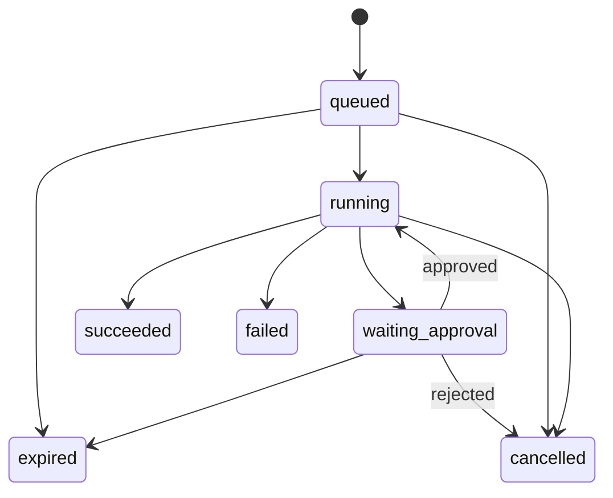

# 核心领域契约

## 两类“任务”必须隔离

- **Harness Work Item**：`HA-0001` 这类研发治理任务，只存在于 `harness/tasks.json`。
- **Product Task**：`task_...` 这类用户提交的 Agent 意图，只存在于未来运行时。

文档中必须使用全称或 ID 前缀，不得把两套状态词汇混用。

## Product Task

Task 是一次不可变的用户意图与执行约束包：

```text
Task
├── objective
├── input resource refs
├── agent spec version
├── engine policy
├── model policy
├── requested permissions
├── budgets
└── runs[]
```

Task 创建后，目标、输入版本、请求权限和预算上限不可原地修改。变更需求创建新 Task，并用 `parent_task_id` 关联。Task 不保存执行状态；列表中的 `latest_run_status` 是派生字段。

## Run

Run 是 Task 的一次执行尝试。状态机为：



终态为 `succeeded`、`failed`、`cancelled`、`expired`，不可覆盖。瞬时模型或工具错误属于 Step retry，不新增 `retrying` 状态；重新执行则创建新 Run，并设置 `based_on_run_id`。

Task 的 `requested_permissions` 表示调用方请求的上限；控制面解析版本化 Policy Profile 后，把最终允许项、拒绝项和决策摘要写入 Run 的 `effective_permissions`。每个 Run 同时固化 `effective_limits`，两者只能等于或严于 Task 上限。Child Run 可以继续收窄但不能扩大；这种“子集”关系由控制面验证，JSON Schema 只验证单个对象形状。

## Child Run

多 Agent 不创建第二套状态模型。子 Agent 是一个 Child Run：

- `parent_run_id` 指向发起它的 Run；
- `parent_step_id` 指向具体委派步骤；
- 使用独立上下文、引擎/模型选择、权限和预算；
- 只通过结构化结果、产物与事件返回；
- 失败策略由父步骤显式选择 `fail_parent`、`continue_with_warning` 或 `fallback`。

P0 不创建 Child Run；P1 的只读检索扩展用于验证该契约。

## Step

Step 是 Run 内一次可审计动作，类型至少包括：

- `model_call`
- `code_execution`
- `tool_call`
- `child_run`
- `approval_wait`
- `artifact_validation`

Step 有稳定 `step_id`、序号、输入摘要、输出摘要、开始/结束时间、用量、错误和 trace 关联。只允许在同一 Run 内对可重试 Step 创建新 attempt。

## Checkpoint

Checkpoint 属于 Run，包含：

- 最新已提交事件序号；
- 有界对话与上下文引用；
- 适配器状态的版本化、不透明引用；
- 已完成 Step 和待执行动作；
- 剩余预算、权限快照摘要和代码沙箱状态引用。

Checkpoint 只追加、带内容摘要。恢复必须验证适配器版本、工具版本、权限和输入资源仍兼容；不兼容时明确失败，不能猜测恢复。

## Approval

Approval 绑定 `run_id + step_id + tool_version + arguments_digest`。批准决定为 `approved` 或 `rejected`；有次数和有效期。参数或版本变化会使批准失效。批准后由控制面自动重新投递同一 Run，不提供面向用户的独立 `resume` 动作。

## Artifact

Artifact 是不可变输出，记录：

- 媒体类型、大小和内容摘要；
- 创建它的 Run/Step、代码摘要和输入资源版本；
- 数据分类、访问范围和保留期；
- 验证状态与检查器版本。

覆盖同名文件会创建新版本，不修改旧对象。

## 关键不变量

1. Task 意图不可变，Run 终态不可变。
2. 一个 Run 同时只有一个有效写入租约。
3. Run 内事件序号严格递增；跨 Run 不承诺全局顺序。
4. 副作用必须由已授权 Step 执行。
5. 成功 Run 必须有终态事件、结果摘要和 Evidence。
6. Child Run 不继承父 Run 的全部权限，只获得显式交集。
