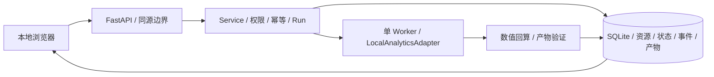
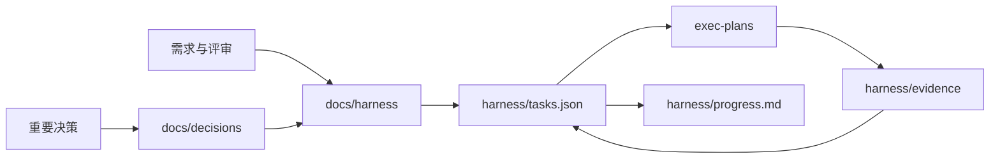

# 现状架构

## 结论

当前仓库已具备 **本地工作台 v0.1**：原生 JavaScript/CSS 前端、FastAPI API、SQLite 持久状态、固定 CSV 分析适配器、无模型 Intent Contract 预检和 launchd 部署。另有 Colima VM 沙箱、真实 Smolagents SDK + 脚本模型探针、离线 Skill CLI、本地固定函数 Child Run 编排、ADR-0023 的三角色投研 Agent / Skill / Tool 模拟垂直切片、ADR-0024 的 Native Claude SubAgent / Plugin Skill / 进程内 MCP 资料运行时实现（默认门禁关闭）、ADR-0025 的外部 ZIP Skill 一次性隔离执行器（默认门禁关闭）、ADR-0026 M1 / ADR-0027 M2-A / ADR-0028 M3-A / ADR-0029 M3-B 的来源优先 Memory Plane、ADR-0033 的 Team Task/Handoff/Gate 与 ADR-0034 的恢复/防循环本机控制面、合成去标识的模型化意图离线/影子评测门禁、无密 Provider/Model/Agent Profile + 本地确定性 POST SSE Agent Lab、ADR-0022 的独立 Provider/Model/Agent/Session/Exchange Runtime，以及已验证 OAuth 连通但数据面关闭的百度网盘连接器；默认仍无真实模型调用、真实 Claude 子 Agent 连通、网盘数据访问或完整长期记忆。



服务地址、运行限制、重启语义与当前接口见 [LOCAL_WORKBENCH.md](LOCAL_WORKBENCH.md)。此前规格阶段的治理结构保留如下。

独立开发验证链路：`harness/probe.py → ScriptedProbeModel → Smolagents CodeAgent → SandboxExecutor → Colima VM`，与生产 Run 路由隔离。脚本模型不会被注册为用户可选引擎。探针范围见 [ENGINE_PROBES.md](ENGINE_PROBES.md)，项目 Skill 示例见 [SKILL_EXECUTION.md](SKILL_EXECUTION.md)。

因此，本文只描述可验证的现状。目标能力见 [ARCHITECTURE.md](ARCHITECTURE.md)，不得把目标图当作已实现系统。

本地研究演示由 `Service → Research → bounded executor pool → ResearchDemoExecutor` 执行，同一 SQLite 保存父子 Run/事件/产物。最多 9 个子任务、全局 3 个并发，原始输入在 Task 中固定，子执行器只接收各自资源，主任务汇总结构化引用。上下文分发隔离不是线程级安全沙箱。恢复和部分失败语义见 [MULTI_AGENT.md](MULTI_AGENT.md)。

ADR-0023 的独立投研 Agent 模拟运行时由 `Service → ResearchAgents → ResearchToolRuntime` 执行。同样使用 Product Task/Run，但在每个 Child Run 固化 `research.financial|industry|risk@1`、第一方本地 Skill SHA-256、唯一的 `resource.inspect` 和二步上限；它记录 Action / Observation / Final 事件，并只汇总独立复算通过的 Child artifact。模型、Provider、网络和外部工具调用恒为零；不是 Claude SDK 或真实金融数据系统。详见 [Research Agent Runtime](RESEARCH_AGENT_RUNTIME.md)。

ADR-0024 新增 `Service → NativeResearch → Claude Agent SDK` 的受控 Native 路径。它仅在两项环境门禁、固定模型/费用、资料端点和精确域名白名单均满足时，创建一个父 Run 和三行 Child Run，并把原生 `Agent` 委派的 tool-use ID 映射回 `financial`/`industry`/`risk` Child Run。`ResearchSourceGateway` 是资料控制点：搜索、抓取、金融 API 和 Public PDF 提取均有输入限制、域名/资源绑定、超时、字节上限和 `source_evidence` 摘要。当前未有批准配置，因此只可读取 runtime blocker；没有 SDK query、CLI、Keychain 或 HTTP 调用，不能写成真实投研已跑通。详见 [Native Claude 投研运行时](CLAUDE_RESEARCH_RUNTIME.md)。

ADR-0025 新增 `FastAPI → ExternalSkillRuntime → SQLite package/execution audit → 一次性 Colima container` 本地执行边界。外部包只可由可信本机用户用 ZIP 上传，内容被固化并在执行前复核 SHA-256；固定 runner 只运行 `entry.py` 的 JSON transform，不继承宿主环境、网络、路径或凭证。默认环境拒绝执行且不读取包/启动 Docker；这条 local-admin audit 路径未与 Product Task/Run 或 Claude/MCP 集成。详见 [外部 Skill 隔离运行时](EXTERNAL_SKILL_RUNTIME.md)。

ADR-0026/0027/0028/0029/0030 的 `FastAPI → MemoryPlane → SQLite canonical Fact + FTS5 projection + explicit relation store + exact Entity catalog` 提供本机 M1 + M2-A + M3-A + M3-B。Bank 固化本地 owner/workspace、分类与保留期；Source Evidence 保存可删除正文与摘要，Fact 绑定来源、时间、分类、状态与置信度。M1/M2 的 Source-backed Fact 读取与 M3-A 一样按 `as_of` 同时过滤 Source 和 Fact 的发生时间及 Fact 有效期；M2-A 以不持久化的 caller recent turns、Fact-derived Capsule、FTS5 关键词目录与按 ID Detail 读取补足压缩/细节闭环；M3-A 仅在调用方显式登记、由 active Fact 支撑的 Entity/Relation 上最多遍历两跳；M3-B 只以 casefold exact canonical name/alias 给出零或多个可追溯 Entity 候选，绝不消歧。ADR-0031 单独将 M2-B semantic/vector/RRF 的准入设为 fail-closed，当前没有 Provider、模型、网络或 embedding index。retract/supersede 使派生对象失效，delete 清除可控正文/Fact/Entity/Relation/FTS。它仍没有自动聊天保存、模型抽取、语义向量、自动实体消歧、自然语言 GraphQA、Reflect、外部 Adapter 或 Product Run 关联。详见 [Memory Entity Catalog M3-B](MEMORY_ENTITY_CATALOG_M3B.md)。

ADR-0033 新增 `FastAPI → TeamCoordination → SQLite team_tasks / handoffs / gate decisions` 的独立协作控制面。它以 requirements/Gate digest 和乐观版本把 Task、Handoff 与验收绑定；SQLite lease 防止并发认领，父项直到所有 Child `done` 或 `closed` 才能提交/通过。它不提供 Channel/Thread 消息、Inbox、attention、freshness、真实身份、Agent Runtime、Daemon、Computer 或自动委派，`scope` 也不替代工具政策。详见 [Team Coordination](TEAM_COORDINATION.md)。

ADR-0034 新增 `FastAPI → RecoveryLoopGuard → SQLite recovery_cases / attempts / observations / reminders / cancel audits` 的独立恢复决策旁路。它由服务端 Error Contract 目录记录失败点、根因假设、回滚 Checkpoint 和 Replan 起点；Try/Confirm/Cancel 都不执行恢复，硬预算与重复 operation 只停止或转人工，且必须回到 ADR-0033 Handoff + Gate pass 才能 resolved。它不实现真实 Checkpoint restore、工具取消、动态权限、通用 Replan 或任何 Agent Runtime。详见 [Recovery Loop Guard](RECOVERY_LOOP_GUARD.md)。

本地分析表单在创建 Task 前调用 `Service → IntentRouter`。该 Router 用 `rules@1` 只识别 CSV 分析，返回 `ready`、`clarification_required` 或 `rejected`；不持久化自然语言输入、没有模型调用，也不会自动创建 Task 或换引擎。规则与固定评测见 [INTENT_ROUTING.md](INTENT_ROUTING.md)。

模型化意图路由仅有离线/影子评测准备：`fixture → candidate-output validator → evaluator → policy gate`。夹具是手写合成去标识数据；没有模型客户端、生产文本或 API 路由接入。候选即使通过也只可申请下一阶段影子回放，详见 [INTENT_MODEL_EVALUATION.md](INTENT_MODEL_EVALUATION.md)。

Plan/Replan 的通用控制合同仍以 `execution-control.schema.json → pure reducer → synthetic evaluation` 为主。ADR-0018 实现固定 Checkpoint 直接恢复；ADR-0019/0020 额外实现一个严格白名单的 Product TCC 路径：只有 checkpoint 后的 `ARTIFACT_PUBLICATION_FAILED` 能生成持久 PlanRevision、Event Evidence、ReplanAttempt 和 `gap@1`。该 Gap 固定为 `node_publish` 缺少已验证产物，Try/Cancel/失败恢复保持 open，只有绑定恢复 Run 成功才写 `gap.resolved`。Confirm 的新 Run 只做 `checkpoint.verify → artifact.publish → run.final_answer`，不重检资源、不调用模型或网络，也不接受调用方编辑 Plan。研究演示仍只支持取消和整树重跑。详见 [Plan / Replan 执行控制](PLAN_REPLAN_CONTROL.md)。

百度网盘连接器由 `Service → BaiduNetdiskConnector → openapi.baidu.com / macOS Keychain` 组成。SQLite 仅保存 state 摘要、期限和无密状态；Client Secret、access token 和 refresh token 留在 Keychain。当前仅 OAuth 连接，不启用目录、下载或分享链接。见 [BAIDU_NETDISK_CONNECTOR.md](BAIDU_NETDISK_CONNECTOR.md)。

ADR-0021 的 Agent Lab 由 `FastAPI → LocalAgentLab → SQLite profile/session/message/exchange` 组成，与 Product `Task/Run/Event/Evidence/Checkpoint/Replan` 表严格分离。配置中没有凭证或 `credential_ref`；Provider URL 从不被请求；Local Demo Responder 只流式发送固定声明文本。浏览器通过 POST + `fetch` 读取 `delta/done` SSE，支持 AbortController 停止显示。它是 UI、会话和持久化准备，不是模型、Provider Adapter、SDK 或 Agent Loop 路由。

ADR-0022 的 Agent Runtime 由 `FastAPI → AgentRuntime → ProviderAdapterRegistry → SQLite runtime_*` 表组成，同样与 Product 控制面和 Agent Lab 分离。它实现 OpenAI-compatible Chat Completions SSE 的协议翻译，但默认 `HARNESS_AGENT_RUNTIME` 不为 `enabled`，Keychain 也只在最后传输边界解析无密 `credential_ref`。因此默认消息仅产生 `MODEL_RUNTIME_DISABLED` Exchange，不请求 Provider，也不创建虚构 assistant 消息。完整边界见 [Agent Runtime](AGENT_RUNTIME.md)。

## 当前文件结构

```text
harnessagent/
├── AGENTS.md
├── README.md
├── plan.md                      # P2 长期记忆规划（Proposed）
├── backend/                     # 本地 API / 控制面 / SQLite / 固定工具
├── frontend/                    # 工作台 / API 说明
├── tests/                       # 契约 / 故障 / 浏览器测试
├── deploy/                      # 本机 launchd 配置
├── docs/
│   ├── harness/                 # 当前有效规格
│   ├── research/                # PDF 阅读与官方资料核验
│   └── decisions/               # 架构决策记录
├── specs/
│   └── v1/                      # Draft 核心 Schema、OpenAPI 与运行时策略
├── exec-plans/
│   ├── active/
│   ├── completed/
│   └── blocked/
├── harness/
│   ├── task.schema.json
│   ├── permissions.schema.json
│   ├── tasks.json
│   ├── state.json
│   ├── progress.md
│   ├── permissions.yaml
│   └── evidence/
└── tech-debt-tracker.md
```

## 当前数据流



这是一条研发治理信息流，不是线上请求处理链路。

## 已具备

- 项目范围、PRD、P0 数据分析流程、目标架构、API 草案和领域地图；
- 规范、质量、安全、运维与技术决策框架；
- Product Task/Run Draft Schema、机器工作项 Schema、任务队列、阶段状态和权限策略 Draft；
- 三份 CodeAct/Smolagents PDF 的阅读记录与部分官方文档核验；
- active/completed/blocked 计划目录与 Evidence 约定。

## 尚未具备（完整目标能力）

- 生产服务、完整控制台、多进程 Worker 或 SDK；
- 引擎、模型、工具、MCP 或知识系统接入；
- 生产数据库迁移、独立队列与对象存储；
- 身份系统、租户隔离和密钥系统；
- 完整 CI/CD、生产监控、告警和发布环境；本地测试已建立。

## 真实 Agent 实现门槛（本地切片以 ADR-0009 为准）

1. 产品范围、P0 场景和非目标获批。
2. 统一 Task/Run、事件、适配器和工具契约通过契约测试并定稿。
3. 首个纵向切片计划明确，默认使用模拟适配器。
4. 身份、隔离、权限、数据保留和威胁模型有决策记录。
5. Smolagents、远程沙箱和 `doubao-seed-2.1-turbo` 图片输入能力探针完成。
