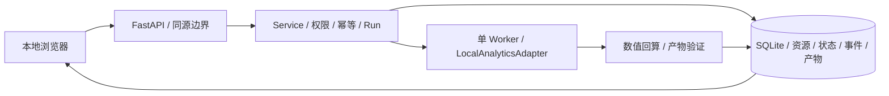
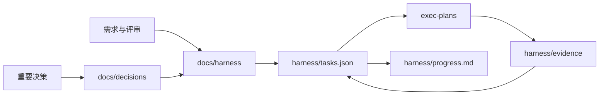

# 现状架构

## 结论

当前仓库已具备 **本地工作台 v0.1**：原生 JavaScript/CSS 前端、FastAPI API、SQLite 持久状态、固定 CSV 分析适配器和 launchd 部署。新增独立的 Colima VM 沙箱、真实 SDK + 脚本模型探针以及离线 Skill CLI；这些尚未加入产品 Run 的真实模型路由。没有接入真实模型、Claude SDK 或长期记忆。



服务地址、运行限制、重启语义与当前接口见 [LOCAL_WORKBENCH.md](LOCAL_WORKBENCH.md)。此前规格阶段的治理结构保留如下。

独立开发验证链路：`harness/probe.py → ScriptedProbeModel → Smolagents CodeAgent → SandboxExecutor → Colima VM`，与生产 Run 路由隔离。脚本模型不会被注册为用户可选引擎。探针范围见 [ENGINE_PROBES.md](ENGINE_PROBES.md)，项目 Skill 示例见 [SKILL_EXECUTION.md](SKILL_EXECUTION.md)。

因此，本文只描述可验证的现状。目标能力见 [ARCHITECTURE.md](ARCHITECTURE.md)，不得把目标图当作已实现系统。

## 当前文件结构

```text
harnessagent/
├── AGENTS.md
├── README.md
├── plan.md                      # P2 长期记忆规划（Proposed）
├── backend/                     # 本地 API / 控制面 / SQLite / 固定工具
├── frontend/                    # 工作台 / API 说明
├── tests/                       # 契约 / 故障 / 浏览器测试
├── deploy/                      # 本机 launchd 配置
├── docs/
│   ├── harness/                 # 当前有效规格
│   ├── research/                # PDF 阅读与官方资料核验
│   └── decisions/               # 架构决策记录
├── specs/
│   └── v1/                      # Draft 核心 Schema、OpenAPI 与运行时策略
├── exec-plans/
│   ├── active/
│   ├── completed/
│   └── blocked/
├── harness/
│   ├── task.schema.json
│   ├── permissions.schema.json
│   ├── tasks.json
│   ├── state.json
│   ├── progress.md
│   ├── permissions.yaml
│   └── evidence/
└── tech-debt-tracker.md
```

## 当前数据流



这是一条研发治理信息流，不是线上请求处理链路。

## 已具备

- 项目范围、PRD、P0 数据分析流程、目标架构、API 草案和领域地图；
- 规范、质量、安全、运维与技术决策框架；
- Product Task/Run Draft Schema、机器工作项 Schema、任务队列、阶段状态和权限策略 Draft；
- 三份 CodeAct/Smolagents PDF 的阅读记录与部分官方文档核验；
- active/completed/blocked 计划目录与 Evidence 约定。

## 尚未具备（完整目标能力）

- 生产服务、完整控制台、多进程 Worker 或 SDK；
- 引擎、模型、工具、MCP 或知识系统接入；
- 生产数据库迁移、独立队列与对象存储；
- 身份系统、租户隔离和密钥系统；
- 完整 CI/CD、生产监控、告警和发布环境；本地测试已建立。

## 真实 Agent 实现门槛（本地切片以 ADR-0009 为准）

1. 产品范围、P0 场景和非目标获批。
2. 统一 Task/Run、事件、适配器和工具契约通过契约测试并定稿。
3. 首个纵向切片计划明确，默认使用模拟适配器。
4. 身份、隔离、权限、数据保留和威胁模型有决策记录。
5. Smolagents、远程沙箱和 `doubao-seed-2.1-turbo` 图片输入能力探针完成。
