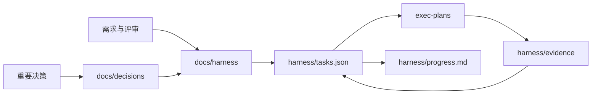

# 现状架构

## 结论

当前仓库处于 **规格评审阶段**，只有治理文档和机器可读任务文件；没有应用代码、运行时、依赖锁、数据库、部署配置或已接入的 Agent 引擎。

因此，本文只描述可验证的现状。目标能力见 [ARCHITECTURE.md](ARCHITECTURE.md)，不得把目标图当作已实现系统。

## 当前文件结构

```text
harnessagent/
├── AGENTS.md
├── README.md
├── docs/
│   ├── harness/                 # 当前有效规格
│   ├── research/                # PDF 阅读与官方资料核验
│   └── decisions/               # 架构决策记录
├── specs/
│   └── v1/                      # Draft 核心 Schema、OpenAPI 与运行时策略
├── exec-plans/
│   ├── active/
│   ├── completed/
│   └── blocked/
├── harness/
│   ├── task.schema.json
│   ├── permissions.schema.json
│   ├── tasks.json
│   ├── state.json
│   ├── progress.md
│   ├── permissions.yaml
│   └── evidence/
└── tech-debt-tracker.md
```

## 当前数据流



这是一条研发治理信息流，不是线上请求处理链路。

## 已具备

- 项目范围、PRD、P0 数据分析流程、目标架构、API 草案和领域地图；
- 规范、质量、安全、运维与技术决策框架；
- Product Task/Run Draft Schema、机器工作项 Schema、任务队列、阶段状态和权限策略 Draft；
- 三份 CodeAct/Smolagents PDF 的阅读记录与部分官方文档核验；
- active/completed/blocked 计划目录与 Evidence 约定。

## 尚未具备

- 可执行服务、控制台、Worker 或 SDK；
- 引擎、模型、工具、MCP 或知识系统接入；
- 数据库 Schema、迁移、队列和对象存储；
- 身份系统、租户隔离和密钥系统；
- 测试、评测、CI/CD、监控、告警和发布环境。

## 进入实现前的门槛

1. 产品范围、P0 场景和非目标获批。
2. 统一 Task/Run、事件、适配器和工具契约通过契约测试并定稿。
3. 首个纵向切片计划明确，默认使用模拟适配器。
4. 身份、隔离、权限、数据保留和威胁模型有决策记录。
5. Smolagents、远程沙箱和 `doubao-seed-2.1-turbo` 图片输入能力探针完成。
