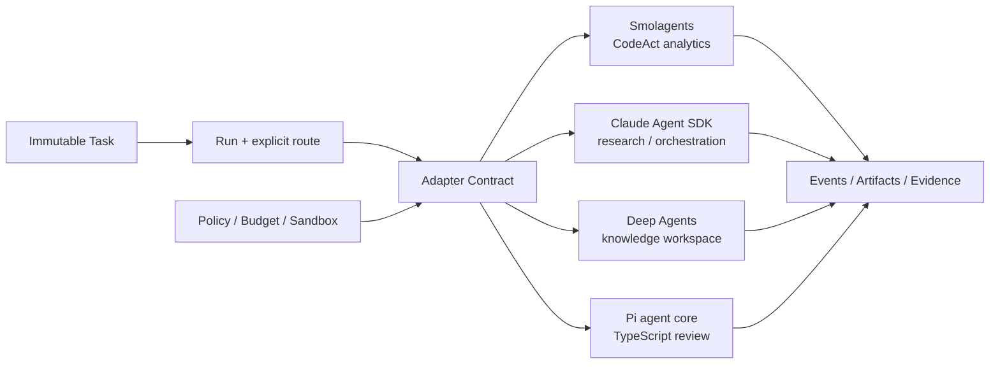

# 四类 Agent 框架接入路线

## 核心结论

四个框架不在一个 Run 内层层嵌套，也不共享私有状态。HarnessAgent 只统一 Task/Run、事件、工具、权限、资源、产物、预算和追踪；每个框架通过独立 Adapter 服务一类被验证过的场景。路由在 Run 创建前显式确定，失败时不静默换引擎。

## 场景与适配器责任

| 阶段 | 场景 | 候选框架 | Adapter 只负责 | 平台仍负责 | 准入证据 |
|---|---|---|---|---|---|
| P0 | CSV 敏捷数据洞察 | Smolagents CodeAgent | Agent Loop、代码/工具事件映射 | 远程沙箱、资源、权限、产物、数值回算 | CodeAct、取消、错误、产物和隔离探针 |
| P1 | 带引用的研报生成 | Claude Agent SDK + Skills | 会话、Skill/工具/MCP 事件映射 | Skill 版本/签名、来源、阶段门禁、产物校验 | 长文一致性、引用、成本、恢复和 Skill 供应链测试 |
| P1 | 复杂业务流 | Claude Agent SDK | 子任务与 Hook/工具事件映射 | Child Run、人工批准、补偿、全链路 trace | 中断恢复、批准绑定、取消和补偿故障注入 |
| P2 | 动态知识库 | Deep Agents + “LMM-Wiki”模式 | 文件工作区、子 Agent、记忆/检索事件映射 | 来源事实、增量索引、删除传播、权限和评测 | 新鲜度、溯源、删除、冲突合并和注入测试 |
| P2 | 合同审查助手 | Pi agent core（TypeScript） | 流式 Agent Loop、工具事件和中止映射 | 条款 Schema、规则引擎、证据定位、批准和沙箱 | 固定合同集、召回/误报、可解释性和权限测试 |

“LMM-Wiki”在此只表示用户提出的动态 Wiki 内容组织模式；在取得其准确项目地址、版本和许可前，不把它登记为可安装依赖。

## 共享契约，不共享实现

- **Agent Spec**：固定引擎、模型、Skill、工具和版本摘要。
- **Task/Run**：Task 保存不可变意图；每个框架的一次执行都是 Run，Run 固化有效权限与预算，子 Agent 是权限/预算只能收窄的 Child Run。
- **Tool Capability**：平台签发最小能力；框架内置权限提示不能替代平台策略。
- **Events**：Adapter 映射为平台事件，但无权提交 `run.succeeded`。
- **Checkpoint**：只保存版本化引用；恢复前核验 Adapter、工具、权限和资源兼容性。
- **Artifacts**：所有报告、图表、Wiki 页面和审查结果先进入不可变产物层并验证。
- **Telemetry**：统一 `trace_id/workspace_id/project_id/task_id/run_id/step_id`，框架原生追踪作为关联信号。

## 框架特有边界

### Smolagents

官方文档提供 CodeAgent、ToolCallingAgent、managed agents、工具/MCP 和多种代码执行器；本地执行不作为不可信代码安全边界。P0 因此只采用 CodeAgent 模式，平台持有沙箱与权限。来源：[Agents](https://huggingface.co/docs/smolagents/reference/agents)、[安全代码执行](https://huggingface.co/docs/smolagents/main/tutorials/secure_code_execution)。

### Claude Agent SDK 与 Skills

Skill、脚本和受控工具分层见 [Skill 执行边界](SKILL_EXECUTION.md)。已有项目内离线脚本样例，但不代表 Claude SDK 已接入；固定流程的强制门禁仍由平台代码负责。

官方 SDK 提供交互会话、自定义工具/Hook 和进程内 MCP 工具；官方 Skills 是包含说明、脚本和资源的版本化能力，并依赖代码执行环境。Adapter 必须固定 SDK/CLI/Skill 版本，Skill 变更视为供应链变更。来源：[Python SDK](https://github.com/anthropics/claude-agent-sdk-python)、[Agent Skills](https://platform.claude.com/docs/en/build-with-claude/skills-guide)。

### Deep Agents

官方仓库把它定位为基于 LangGraph 的 opinionated harness，包含子 Agent、可插拔文件系统、上下文/记忆、HITL、Skills 与 MCP。其安全说明明确要求在工具/沙箱层实施边界，不能依赖模型自律。因此只把这些能力映射到平台契约，不复用其权限判断作为最终授权。来源：[Deep Agents 官方仓库](https://github.com/langchain-ai/deepagents)。

### Pi

当前官方仓库已从 `badlogic/pi-mono` 重定向到 `earendil-works/pi`，提供 TypeScript 的 `pi-agent-core`、多模型层和 coding agent。官方同时说明 Pi 没有内置文件、进程、网络或凭证权限系统，默认继承启动进程权限；合同审查 Adapter 必须使用平台 Tool Runtime 和沙箱。来源：[Pi 官方仓库](https://github.com/earendil-works/pi)。

## 路由规则

1. 用户或 Agent Spec 明确选择场景策略；Capability Router 只验证，不凭偏好猜测。
2. 创建 Run 时写入 Adapter、模型、Skill、工具、沙箱镜像和策略版本。
3. 不满足能力、数据地域或安全约束时创建失败结果，不自动换框架。
4. 同一 Task 的框架对比必须创建不同 Run，使用相同输入版本和评测器。
5. 新 Adapter 先在探针分支通过统一契约测试，再进入可选路由。
