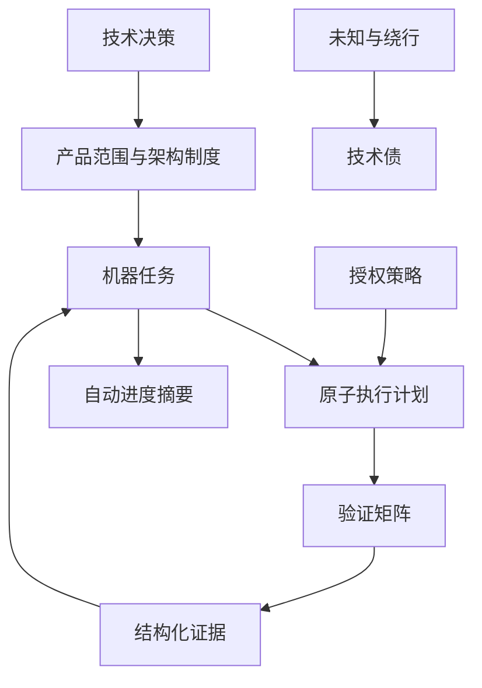

# Harness 组成与实施清单

## 定位

这里的 Harness 是项目治理与长期协作结构：把稳定知识、机器状态、执行计划、授权边界和验证证据分开保存。它约束研发过程，但不进入产品线上请求链路。

## 为什么长任务会失控

- 上下文持续增长后，模型容易遗漏早期约束并降低执行精度。
- 每次会话重新扫描项目，重复消耗时间与 Token，结论也可能不一致。
- 进度只存在于对话时，会话中断后无法准确恢复。
- 目标、非目标、权限和完成定义不明确时，执行范围容易漂移。
- 缺少自动验证时，“已经完成”只是陈述，不能形成可复核事实。

因此 Harness 解决四件事：知识复用、状态恢复、边界约束、自动检查。

## 组成

| 组件 | 作用 | 维护方式 |
|---|---|---|
| `AGENTS.md` | 150 行内的项目地图和硬规则 | 人工精炼，自动进入上下文 |
| `docs/harness/` | 产品、现状、目标架构、API 和制度 | 评审后更新 |
| `docs/decisions/` | 重要决策的背景、选择和后果 | 一项决策一篇 ADR |
| `exec-plans/` | active/completed/blocked 执行计划 | 随任务流转 |
| `task.schema.json` | 原子任务机器格式 | 版本化 Schema |
| `tasks.json` | 唯一机器任务状态 | 执行器更新 |
| `state.json` | 当前阶段、运行和检查点 | 执行器更新 |
| `progress.md` | 给人阅读的状态摘要 | 从 JSON 自动生成 |
| `permissions.yaml` | 风险等级和授权策略 | 安全评审后更新 |
| `evidence/` | 测试、评测、发布与健康证据 | 自动生成优先 |
| `tech-debt-tracker.md` | 技术债、影响、触发条件 | 评审维护 |

## 文件之间的关系



## 建立步骤

### H0：冻结边界

- `Drafted` 建立独立项目目录。
- `Drafted` 声明当前仅做规格，不开始实现。
- `Drafted` 写清目标、用户流程、非目标和首个里程碑。
- `Drafted` 分开记录现状架构与目标架构。

### H1：建立制度

- `Drafted` 建立产品、API、架构、领域、规范、质量、安全、运维文档。
- `Drafted` 建立 ADR 索引和初始决策；只有 ADR-0001 已接受，其余待评审。
- `Verified` 将 `AGENTS.md` 控制在 150 行内，只留地图与硬规则。

### H2：建立机器状态

- `Drafted` 定义原子任务 Schema。
- `Drafted` 建立唯一任务文件、当前状态和人类摘要。
- `Drafted` 建立带机器 Schema 的风险等级与授权策略；尚未实现执行器。

### H3：建立执行闭环

- `Drafted` 建立 active/completed/blocked 计划目录。
- `Drafted` 规定 Evidence 目录和完成定义。
- `Pending` 设计 `init`、`verify`、`run-task` 命令接口；规格批准前不实现脚本。
- `Pending` 让进度摘要由机器状态自动生成。

### H4：启动实现

- `Pending` 批准第一个 active plan。
- `Pending` 只实现“统一 Task/Run → 模拟适配器 → 只读工具 → 事件 → Evidence”的纵向切片。
- `Pending` 完成 Smolagents 与远程沙箱探针，再决定是否接受首个真实适配器 ADR。
- `Pending` 完成 `doubao-seed-2.1-turbo` 图片输入能力探针后启用视觉路由。
- `Pending` 每增加适配器都重复许可、安全、契约和评测审查。

## 原子任务清单要求

每项任务至少包含：

- 唯一 ID、标题、状态和风险；
- 明确范围与非目标；
- 可机器或人工复核的验收条件；
- 依赖、负责人和执行计划路径；
- 阻塞原因与恢复条件；
- Evidence 引用。

## 执行计划模板

```markdown
# <task_id> <title>

## 目标与非目标
## 现状证据
## 变更步骤
## 风险与授权点
## 验证矩阵
## 回滚方案
## Evidence 位置
```

## 换班恢复协议

新会话只需：读取 `AGENTS.md` → 查看 `state.json` 和 `tasks.json` → 打开当前 active plan → 核对最新 Evidence → 从明确检查点继续。不得仅凭对话摘要猜测进度。
