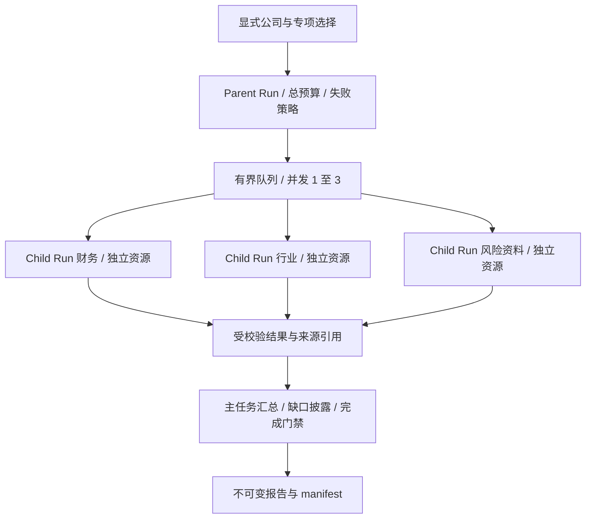

# 多专项研究编排（本地演示）

## 产品语义

离线 synthetic 公司资料演示“财务/行业/风险资料覆盖”三个独立工作项。不是投资建议、实时资讯、真实财报解析或 Claude SDK 实际运行。



## API

`POST /api/local/research`，必须提供 Idempotency-Key。输入字段：

```json
{"companies":["demo_a"],"roles":["financial","industry","risk"],"concurrency":3,"failure_policy":"continue_with_warning","scenario":"complete","timeout_seconds":60,"max_steps":4}
```

- companies：demo_a/demo_b/demo_c 中的 1–3 个，不重复；roles 同理 1–3 个。
- scenario：complete 或 missing_risk，用来验证显式缺失资料的失败汇总。
- timeout_seconds：1–120；max_steps：至少子任务数 + 1，最大 30；每个 child 一次固定处理，root 一次汇总。无 Token/费用开销，不能把此预算用于模型。
- 返回 `{task,initial_run}`。相同幂等键重放，不同请求冲突。
- `GET /api/local/research`：根任务列表。
- `GET /api/local/research/{run_id}`：父 Run、子 Run、角色、来源摘要和产物引用。详情只接受根 Run。
- `POST /api/v1/runs/{run_id}:cancel`：父取消级联，子取消只影响该子任务。
- `POST /api/v1/tasks/{task_id}/runs`：整树重跑；based_on 必须是该任务的根 Run。
- 事件、产物下载复用 `/api/v1/runs/...` 和 `/api/v1/artifacts/...`。

Task/Run 机器格式复用 core-contracts；新本地请求格式见 research-request.schema.json。成功仅说明分配清单按策略完成；continue_with_warning 的报告必须标明 coverage=partial、失败数量和未知风险。

## 验收与非目标

测试：并发峰值上限/确实重叠、跨请求全局限制、输入和结果隔离、权限不可扩大、预算不足、父子取消、重复请求、整树重跑、部分失败、未知结果/伪造引用拒绝、重启恢复、固定分析器回归和窄屏 UI。

应用上下文隔离不保证 OS 隔离。本版执行器是经过审查的固定代码；引入外部代码/模型工具前须接入 VM。无自动重试外部副作用，不实现任意 DAG、递归委派、原生 SDK Agent Tool 调用或生产多租户。

## 材料核验

多 Agent 不是三倍提速保证：理想耗时约为最慢子任务 + 调度与汇总；限流、共享资源和重复检索会降低收益。单 Agent 也可以并发发起独立工具调用，不能把并发与多 Agent 等同。

官方 Subagents 文档支持独立角色、工具和模型配置；非 fork 子 Agent 默认不携带父历史，但可能加载项目配置与工具。skills 用于预加载，不能当作唯一可调用技能白名单。model 字符串不保证第三方端点兼容。复用第三方 Skill 前核验来源、版本、依赖与脚本权限；本项目不安装材料中未提供可验证包的 ClawHub Skills。

来源：[官方 Subagents](https://code.claude.com/docs/en/agent-sdk/subagents)、[Python AgentDefinition](https://github.com/anthropics/claude-agent-sdk-python/blob/main/src/claude_agent_sdk/types.py)。核验日期：2026-09-12。具体字段以固定 SDK/CLI 版本实测为准。

## 实际 SDK 离线验证

```sh
.venv/bin/python -m pip install -r requirements-claude.txt
.venv/bin/python -m adapters.claude_config
```

固定安装 claude-agent-sdk 0.2.152，仅构造并序列化 AgentDefinition/ClaudeAgentOptions，不调用 query、不创建 SDKClient、不启动 CLI。验证 skills、model、maxTurns、mcpServers 等真实字段；全局配置源和 Skills 为空，子工具为空。输出 mode=offline_configuration_only，不是可直接生产运行的配置。

此 Python 包可选，不在核心 API 启动路径导入。测试环境可安装 requirements-claude.txt 运行配置测试；未安装时显式跳过。真实 SubAgent 仍需工具/沙箱/权限/端点/成本及事件父子关系的运行探针。

## 本地运维

运行入口 `/research`；回滚只回退代码并重启 launchd，数据库结构未变，不在线覆盖数据。HA-0009 部署前备份位于 `.local/backups/pre-ha0009-20260912.db`，保留原有分析数据和新演示任务。旧任务继续可访问；CSV 页面仅展示分析任务，研究页面展示研究根 Run。

浏览器验收会创建明确标为演示的任务。执行器为短小有界固定函数；未来若接入不响应取消的第三方代码，线程无法强杀，必须先改为隔离执行边界，不得直接将其替换成任意工具。

## 后续独立模拟切片

ADR-0023 没有改写本文的历史固定函数演示，而是另行实现 `/research-agents` 的三角色 Agent / Skill / Tool 合同模拟。它补充 Action / Observation / Final 事件和 Skill 摘要审计，但依旧不是 Claude SDK、真实模型或金融数据系统；详见 [Research Agent Runtime](RESEARCH_AGENT_RUNTIME.md)。
