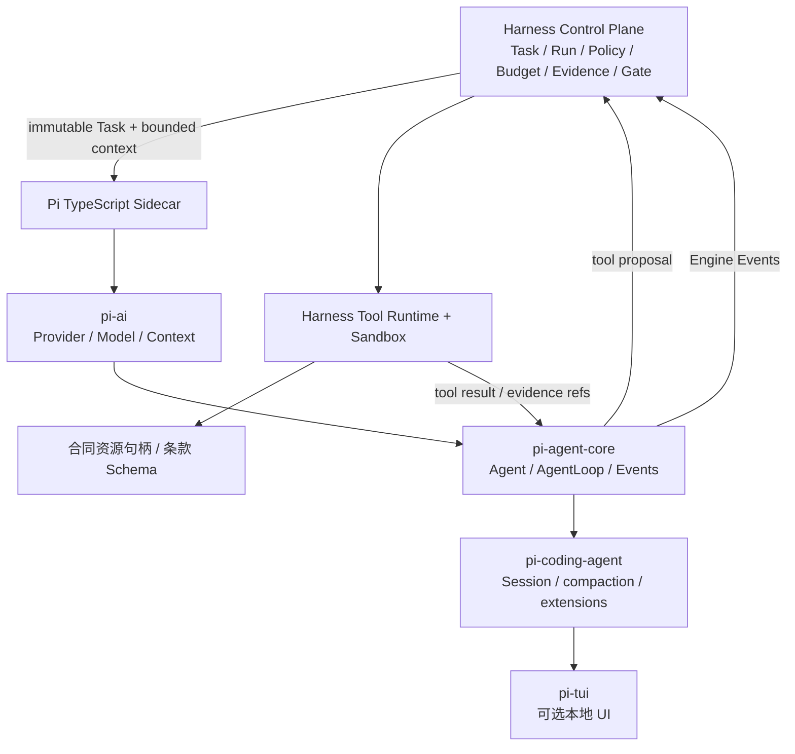

# Pi Adapter 与合同审查 Agent 设计

状态：Proposed（P2-Pi-0 离线探针与 P2-Pi-1 适配器契约已实现；生产接入未开启）
适用阶段：P2 合同审查助手  
关联：`docs/harness/ADAPTER_CONTRACT.md`、`docs/harness/FRAMEWORK_INTEGRATION.md`、ADR-0040

## 1. 设计结论

Pi-mono 适合作为 HarnessAgent 的 TypeScript Agent Runtime，但不应替代控制面。采用 **Pi sidecar + Harness 控制面**：Pi 负责模型协议、Agent Loop 和流式事件；HarnessAgent 继续负责 Task/Run、权限、预算、工具、沙箱、条款 Schema、Evidence、人工 Gate、审计和回滚。



## 2. 四层职责映射

| Pi 层 | 负责 | HarnessAgent 必须保留的边界 |
|---|---|---|
| `pi-ai` | Anthropic/OpenAI/Google/Bedrock 等 Provider/Model/Context 统一抽象、流式协议与工具调用格式 | Provider 准入、模型固定、Keychain 引用、端点/域名、费用/Token/时间上限；Pi 不读取明文凭证 |
| `pi-agent-core` | Agent、AgentLoop、turn、steering/followUp、工具调用和事件订阅 | Task/Run 状态机、每轮预算、取消、权限和 Tool Runtime；Pi 不能直接执行宿主副作用 |
| `pi-coding-agent` | AgentSession、会话持久化、上下文压缩、重试、扩展和高层工具集 | 生产 Session/Handoff/Checkpoint 仍由平台契约管理；高层隐式工具必须逐项映射并经准入 |
| `pi-tui` | 本地终端差分渲染、选择器、对话框和进度显示 | 仅是可选 UI，不参与服务端授权、事实存储或成功判定 |

初始生产 Adapter 只建议组合 `pi-ai + pi-agent-core`。`pi-coding-agent` 的隐式会话/工具能力先用于本地实验；没有完成状态、凭证、文件和扩展映射前，不将其作为服务端事实源。`pi-tui` 不进入远程 Worker。

## 3. 事件驱动 Loop 合同

Pi 的事件流是运行时观察面，不是平台状态机。一个 `turn` 表示一次 assistant 响应及其触发的工具调用/结果；`agent_end` 只表示本次 prompt 不再产生新事件，不等于平台 Run 成功。

### 3.1 事件映射

| Pi 事件 | 平台事件/处理 | 约束 |
|---|---|---|
| `agent_start` | `run.started` / engine metadata | 固定 AgentRevision、Pi 版本、模型和策略摘要 |
| `turn_start` | `model.call.started` 或 `step.started` | 核对剩余 turn/time/cost；超限前拒绝 |
| `message_start/update/end` | `model.delta`（可选）/ `model.call.completed` | 增量输出可限频；持久化摘要和引用，不默认保存完整内部推理 |
| `tool_execution_start` | `tool.call.requested` | 先交给 Harness Tool Runtime 做 Schema、权限、资源、预算检查 |
| `tool_execution_end` | `tool.call.completed` 或 `tool.call.failed` | 只接受带结果摘要、artifact/evidence 引用和用量的返回 |
| `turn_end` | `step.completed`、扣减预算 | 记录本轮 tool 数、tokens、cost、状态；决定继续或合法退出 |
| `agent_end` | `run.result.proposed` | 结果仍需 Artifact/Evidence/Gate 校验，不能直接写 `run.succeeded` |
| error/abort | `run.failed` / `run.cancelled` | 保留 Error Contract、取消来源和清理结果 |

未知 Pi 事件必须进入 `adapter.protocol_error` 并终止当前 Run；不能透传成平台成功事件。`message_update` 只作为 UI/Telemetry 可选流，不应让每个 token 形成一条持久业务事件。

### 3.2 运行序列与背压

```text
agent_start
  → turn_start
  → message_start(user) → message_end(user)
  → message_start(assistant) → message_update* → message_end(assistant)
  → tool_execution_start
  → Harness authorize → Tool Runtime execute
  → tool_execution_end
  → message_start(toolResult) → message_end(toolResult)
  → turn_end
  → (next turn | run.result.proposed)
  → agent_end
```

Sidecar 不把整个事件流无界地推给控制面：事件先进入有界队列，`message_update` 可合并为 50–200ms 的增量，工具和状态事件不得丢失。控制面消费变慢时，优先丢弃可重建的显示增量，保留 `tool_execution_*`、预算、取消、错误和结果事件；队列溢出必须产生 `adapter.backpressure` 并安全终止，而不是静默丢证据。

### 3.3 Steering 与 followUp

- steering 只能注入当前 Run 已授权范围内的人类纠正或策略消息；不能扩大工具、网络、文件或预算权限；
- followUp 只能排队为下一 turn 的输入，并带上来源消息、Task 版本和新鲜度检查；
- 当前 turn 收到取消、Task 版本变化或权限撤回时，Pi 侧立即停止生成，平台仍以事务方式记录终止原因；
- 同一 Run 的 steering/followUp 必须受 Inbox/freshness 规则约束，不能由 Pi 私有队列绕开平台。

## 4. Sidecar 协议与部署形态

首版采用本机/同机容器的长驻 TypeScript Worker，由 Python 控制面通过版本化 JSONL over stdio 或 loopback Unix socket 连接；不直接开放公网端口。若后续迁移到独立 Computer，再将同一消息合同封装为出站 WebSocket，不改变 Engine Event 语义。

### 4.1 请求

```json
{
  "protocol": "pi-adapter@1",
  "op": "start",
  "task_id": "task_123",
  "run_id": "run_456",
  "task_version": 3,
  "agent_revision": "pi-contract-review@0.1.0",
  "model": {"provider": "approved-ref", "model_id": "approved-ref"},
  "context": {"resource_refs": ["res_contract_1"], "rule_set": "contract-risk@1"},
  "limits": {"max_turns": 12, "timeout_seconds": 300, "max_cost_minor": 100},
  "capabilities": ["clause.extract", "evidence.locate"]
}
```

`model.provider` 和 `credential_ref` 只允许是控制面签发的引用；sidecar 不接收明文 Key。所有输入带 Task/资源版本，防止旧 Run 继续处理已变更合同。

### 4.2 输出

每行一个带序号的事件：

```json
{
  "protocol": "pi-adapter@1",
  "seq": 17,
  "run_id": "run_456",
  "event": "tool.call.requested",
  "turn": 2,
  "payload": {"tool": "evidence.locate", "input_digest": "sha256:..."},
  "usage": {"input_tokens": 1200, "output_tokens": 180, "cost_minor": 2}
}
```

控制面按 `run_id + seq` 幂等写入；重连从最后确认序号继续。sidecar 只能发送 `run.result.proposed`，最终成功由平台根据产物、Evidence、Gate 和任务版本提交。

### 4.3 操作

| 操作 | 语义 | 结果 |
|---|---|---|
| `start` | 用固定 Task/Run/Revision 启动一轮 | 事件流和 sidecar execution id |
| `steer` | 注入经 freshness 校验的人类纠正 | 排队到当前/下一 turn，不能扩权 |
| `follow_up` | 追加下一轮输入 | 需匹配当前 Task 版本 |
| `cancel` | 请求中止生成和工具 | `accepted`/`terminated`/`unknown`，均写审计 |
| `health` | 返回版本、能力和是否有活动执行 | 不调用模型 |
| `probe` | 假模型、假工具和事件契约验证 | 结构化 Evidence，不进入 Product Run |

## 5. 合同审查业务纵切

输入是已授权的合同资源句柄、合同类型、我方角色、审查规则版本和语言；输出不是一句“风险很高”，而是可审计的风险项集合：

```json
{
  "clause_id": "clause-12.3",
  "location": {"page": 8, "heading": "价格调整"},
  "claim": "甲方可单方调整价格，未定义通知期和上限",
  "risk_level": "high",
  "evidence_refs": ["artifact://contract/page-8/text-03"],
  "rule_id": "pricing unilateral-change@1",
  "recommendation": "补充触发条件、通知期、调整上限和异议权",
  "needs_human": true
}
```

最小流程：

1. Harness 校验资源、数据分类、合同类型、我方角色和审查规则版本；
2. Pi 读取受限文本/页码工具的摘要，不直接读取任意宿主路径；
3. Pi 识别条款并调用 `clause.extract`、`evidence.locate` 等平台工具；
4. Tool Runtime 校验参数、范围、超时和费用，返回带位置的 Evidence；
5. Pi 形成结构化风险候选与修订建议；
6. Harness 复核 JSON Schema、引用完整性、规则命中和风险等级；
7. 高风险或证据不足项进入 `needs_human`，人工 Gate 通过后才生成正式报告/修改稿。

Pi 的总结、推断和建议必须与 Evidence 分离；没有定位证据的内容只能标为 `unverified`，不能作为法律结论。系统不自动替代律师意见。

### 5.1 领域对象

| 对象 | 关键字段 | 产生者 | 是否权威 |
|---|---|---|---|
| `ContractResource` | 资源 ID、版本、页数、分类、SHA-256 | Resource Service | 合同原文版本 |
| `ClauseCandidate` | 条款 ID、位置、文本摘要、章节 | Pi + Tool Runtime | 待验证 |
| `Evidence` | 来源资源、页码/偏移、摘录 digest、规则 | Tool Runtime | 可审计证据 |
| `RiskFinding` | 风险、等级、依据、建议、状态 | Pi，平台校验 | `unverified`/`needs_human`/`accepted` |
| `ReviewDecision` | 审核人、决策、理由、版本 | Human Gate | 审核事实 |
| `RedlineArtifact` | 修订稿、差异、引用、规则版本 | 平台 Artifact | 需再次审核 |

禁止让 `RiskFinding` 直接覆盖合同原文或自动生成可签署版本；任何修改建议必须以独立 Artifact 交付。

## 6. 上下文、Session 与 Checkpoint

Pi 的内部 Context/Compaction 不直接等同于平台 Checkpoint。首版只允许保存：Pi/Adapter 版本、模型快照、已完成 turn、输入资源版本、工具结果引用、风险候选和剩余预算。不得把明文 Key、隐式 session 文件或不可验证的内部状态当作可恢复依据。

将 Pi 的上下文分成三层：

1. **Working Context**：当前 turn 的消息、工具结果和临时草稿，只在 sidecar 内存中存在；
2. **Session Context**：经压缩的目标、已确认事实、未决风险、Evidence refs 和下一步，平台以受限 Handoff 保存；
3. **Durable Evidence**：合同资源、条款定位、审查规则、风险产物和 Gate 决策，进入平台 Artifact/Evidence。

Pi 的 Context Compaction 只能生成候选 Session 摘要，必须通过字段校验和来源覆盖检查。摘要丢失的细节通过 `evidence.locate` 按资源版本、条款 ID、页码或 digest 重新召回，而不是把全部原文永久塞进 Session。

只有当 Pi 能提供版本化、无密、可校验的状态快照，且恢复前通过 Adapter/工具/权限/资源兼容性检查，才可申请 `state.restore`。否则错误恢复使用新的 Pi Session，并从 Evidence/Artifact/Handoff 重新装配上下文。

## 7. Sidecar 工程结构（目标）

```text
pi-adapter/
├── package.json                 # 锁定 Node、Pi 包和脚本
├── src/
│   ├── protocol.ts              # pi-adapter@1 请求/事件 Schema
│   ├── runtime.ts               # pi-ai + pi-agent-core 组装
│   ├── event-bridge.ts          # Pi 事件 → Engine Events
│   ├── tool-gateway.ts          # 转发 Harness Tool Runtime
│   ├── budget-guard.ts           # turn/time/token/cost/cancel
│   ├── context-handoff.ts        # 压缩候选与平台 Handoff
│   └── contract-review.ts        # 领域 prompt/输出校验，不持有权限
├── schemas/
│   ├── pi-adapter.schema.json
│   └── contract-review.schema.json
└── probes/
    ├── fake-model.ts
    └── event-sequence.ts
```

Python 侧只新增一个 `PiAdapter` 实现 `ADAPTER_CONTRACT`；不把 Pi 类型、Session 文件或 Provider 私有状态写入 Python 数据库。两侧通过 `task_id/run_id/seq/artifact_ref/evidence_ref` 交接。

## 8. 安全与运行准入

- Pi 进程运行在独立 sidecar/Worker，不直接拥有宿主项目目录、网络和凭证；
- 所有工具请求必须经过平台 Tool Runtime；Pi 的工具定义、扩展和 prompt 不是安全边界；
- `pi-ai` 仅接收经准入的 Provider/模型引用和短期凭证句柄；严禁在 Event、Artifact、Git 或日志中写入 Secret；
- 每 Run 固定 Pi、pi-ai、pi-agent-core、扩展和规则版本，记录 SHA/版本摘要；
- 费用、Token、turn、总时长、并发和取消由平台硬限制；Pi 只能报告用量，不能自行放宽；
- 合同原文按 Workspace/数据分类隔离；跨项目、外部分享和训练用途默认拒绝；
- 发生未知事件、工具越权、引用缺失、schema 失败或费用超限时 fail closed。

## 9. 分阶段实施

### P2-Pi-0：离线契约探针

- [x] 固定 Pi 官方仓库、版本、许可证和 Node/TypeScript 运行环境；当前包为 `@earendil-works/pi-agent-core@0.87.1`、`@earendil-works/pi-ai@0.87.1`、Node `>=22.19.0`；
- [~] 用 Faux Provider 生成事件序列，已验证 turn、tool、abort、未知事件和背压；steering/followUp 仍需独立队列探针；
- [x] 将事件映射为 `Engine Events`，不调用网络、不读取凭证、不执行真实工具。实现见 [`pi-adapter/`](../../pi-adapter/)。

### P2-Pi-1：合同审查模拟纵切

- [x] 已实现 Faux Provider sidecar 的 `start/stream/cancel/health` JSONL 协议、非准入模型拒绝，以及 Python 侧 transport smoke client；
- [x] 已接入固定 Public PDF 夹具边界、`evidence.locate`、结构化高风险输出和 `needs_human` Gate 候选；实现见 `adapters/pi_contract_review.py`；
- [x] 固化 `specs/v1/pi-contract-review.schema.json`，约束 Evidence 引用、风险输出和 Gate 候选的机器形状；
- [ ] 将适配器结果写入 Product Run、Artifact/Evidence 和正式平台 Gate；
- [ ] 用平台假 Tool Runtime 验证权限、预算、引用和人工 Gate；
- [ ] 评测召回、误报、引用覆盖、schema 通过率、取消延迟和成本估算。

### P2-Pi-2：受控真实模型

- [ ] 完成 Provider/模型/域名/Keychain/费用和数据外发准入；
- [ ] 运行固定合同集的真实模型 Probe，记录每个 turn、工具、引用、费用和失败恢复；
- [ ] 通过人工审查与回滚演练后，才允许灰度路由。

## 10. 当前结论

Pi 的分层和事件驱动设计已经通过本地 Faux Provider 离线探针验证；当前仓库仍没有 TypeScript sidecar 服务、合同审查工具、Python Product Adapter 或真实模型调用。本文与 `pi-adapter/` 只冻结并验证接入边界，不把离线探针误写成生产合同审查能力。
