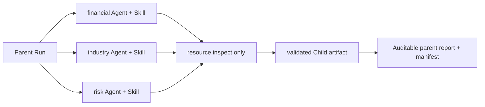

# 投研多 Agent 模拟运行时（HA-0026）

这是一个**本地、确定性、零外部调用**的 P1 准备切片。它用 Product Task / Run / Event / Artifact 验证投研主控与三个专项 Child Agent 的契约；不是 Claude Agent SDK 的实际执行、真实研报、实时新闻或投资建议。

## 运行模型

每个 Agent 固化 `research.<role>@1`、对应 `skills/research-*/SKILL.md` 的 SHA-256、`resource.inspect` 和二步预算。模拟循环只表示结构化 Action / Observation 边界：一次只读工具调用加一次终结答案；没有模型调用、隐藏推理、Provider、MCP、WebSearch、WebFetch 或真实数据读取。

## API

- `POST /api/local/research-agents`：须有 `Idempotency-Key`；输入见 [`research-agent-runtime.schema.json`](../../specs/v1/research-agent-runtime.schema.json) 的 `research_agent_request`。
- `GET /api/local/research-agents`：根 Run 历史。
- `GET /api/local/research-agents/{runId}`：父 / 子 Run、不可变 Agent 注册表、Skill 摘要、已验证产物与使用量。
- 取消和整树重跑复用 `POST /api/v1/runs/{runId}:cancel` 与 `POST /api/v1/tasks/{taskId}/runs`。

`max_steps` 至少等于 `公司数 × 3 × 2 + 1`：每个 Child Run 两步，父级留一回合汇总。最大并发为三；所有费用和模型 / Provider / 网络调用恒为零。

## Failure and evidence policy

- 只读工具仅可读取 Child 已分配资源；调用或 Skill 摘要漂移直接失败。
- `continue_with_warning` 只在至少一个子结果通过时发布标有 `coverage=partial` 的报告；`fail_parent` 不发布父报告。
- 每个 Child artifact 均重新按原始资源计算；父级只引用 SHA-256 一致的 Child artifact。
- `missing_risk` 是故意的资料缺口，输出必须是“未评估”，绝不表述为没有风险。

## 未实现能力

未接入 Claude Agent SDK、模型、用户上传财报 PDF、AKShare / Tushare、WebSearch、WebFetch、外部 MCP、第三方 Skill、持久 Agent Memory 或真实金融报告。它们需按 ADR-0023 的前置技术债和单独授权推进。
