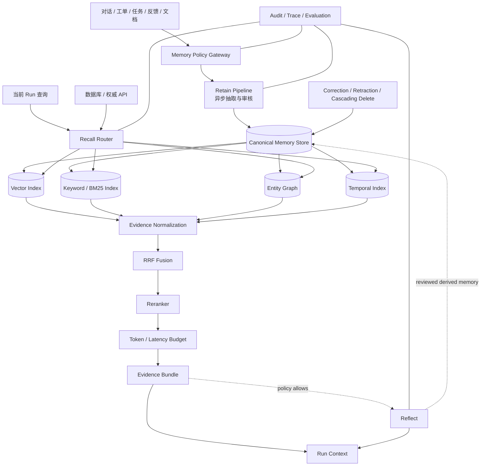

# HarnessAgent 长期记忆规划

> 状态：Proposed
>
> 目标阶段：P2
>
> 当前约束：本文件是设计计划，不代表已经实现、选型或接入 Hindsight。P0 不依赖长期记忆。

## 1. 目标与定位

长期记忆用于处理“历史会影响当前判断”的跨会话任务，例如用户偏好、项目约定、历史决策、长期排障和可复用经验。它不是扩大上下文窗口，也不是用向量库替代业务数据库。

HarnessAgent 中的长期记忆应是一个独立、受策略控制的 **Memory Plane**：负责把有长期价值的历史加工为可追溯证据，在需要时检索，并可选地基于证据形成可修正的观察或观点。

核心目标：

- 只保存值得长期复用的信息，而非永久保存全部对话；
- 区分原始来源、事实、关系、归纳和观点；
- 支持实体关系、多跳查询、时间变化和新旧冲突；
- 每次记忆写入、召回和推理都可授权、追踪、解释、纠错和删除；
- 允许按任务关闭、降级或绕过长期记忆，不把它变成所有请求的强制主链路。

明确非目标：

- 不以记忆替代数据库、业务 API 或其他权威事实源；
- 不以记忆替代静态知识库的普通 RAG；
- 不把模型生成的摘要或观点自动提升为事实；
- 不承诺永久保存完整 Prompt、内部推理或原始会话；
- 不在 P0 数据分析纵向切片中实现长期记忆；
- 不在完成官方资料、许可、部署与安全验证前锁定 Hindsight 或其他产品。

## 2. 请求路由原则

| 问题类型 | 首选事实路径 | 长期记忆的角色 |
|---|---|---|
| 强一致业务事实、实时状态 | 数据库或权威 API | 只能补充历史背景，不能覆盖事实源 |
| 静态文档、代码、API 问答 | 普通 RAG 或专用检索 | 默认不启用 |
| 用户偏好、项目约定、历史决策 | Agent Memory | 召回带来源和时间的历史证据 |
| 跨会话排障、经验复用 | Agent Memory | 找回已验证结论、已排除路径和结果 |
| 新旧信息冲突、多跳关系 | 多路 Recall | 结合实体、时间和来源排序证据 |
| 方案选择、偏好推断 | Recall + 可选 Reflect | 基于证据形成带置信度的判断 |
| 单次简单查询、强实时主链路 | 当前上下文 | 默认关闭，避免增加延迟和噪声 |

控制面必须在 Run 创建前解析是否启用记忆、允许哪些 memory bank、最大延迟和 Token 预算。适配器不得自行扩大访问范围或静默开启 Reflect。

## 3. 核心记忆模型

```text
Memory Bank
├── Source Evidence        原始、不可变、可定位的来源引用
├── Fact                   从来源抽取的原子事实
├── Entity / Relation      规范化实体及其关系
├── Observation            由多条事实归纳、可重新计算的长期观察
└── Opinion / Mental Model 基于证据形成、带置信度且可修正的判断
```

### 3.1 对象定义

| 对象 | 用途 | 必须具备 |
|---|---|---|
| Memory Bank | 用户、项目、团队或 Agent 的隔离边界 | `workspace_id`、作用域、所有者、策略版本、保留规则 |
| Source Evidence | 回答“记忆来自哪里” | 不可变资源版本、位置、摘要、采集时间、数据分类 |
| Fact | 可复用的最小证据 | 内容、实体、时间、来源、置信度、状态 |
| Entity | 统一同一对象的不同名称 | 类型、规范 ID、别名、解析证据 |
| Relation | 支持实体关系和多跳检索 | 起点、终点、关系类型、有效期、来源 |
| Observation | 多条事实形成的稳定模式 | 支撑事实列表、适用范围、生成器版本、更新时间 |
| Opinion / Mental Model | 面向决策的可演化判断 | 结论、证据链、置信度、相关实体、更新时间、反证 |

### 3.2 时间、来源和状态

每条可召回记忆至少记录：

- `occurred_at`：事件实际发生时间；
- `recorded_at`：系统写入时间；
- `valid_from` / `valid_to`：事实或偏好的适用区间；
- `source_evidence_ids`：可回到原始材料的引用；
- `confidence`：抽取或归纳置信度；
- `status`：`active`、`superseded`、`retracted` 或 `expired`；
- `data_classification`、保留期与访问范围；
- 生成该记忆的模型、Prompt、规则和 Schema 版本摘要。

新信息出现时，不应简单覆盖或物理删除旧事实。控制面应通过 supersede、retract 和有效期表达演化，并保留可审计历史。Observation 与 Opinion 是派生对象，必须能够从仍有效的证据重新计算。

## 4. 目标架构



架构边界：

- **Memory Policy Gateway**：统一决定能否写、能否读、能否 Reflect、可访问哪个 bank，以及数据保留和模型边界；
- **Retain Pipeline**：从来源中抽取事实、实体和关系，执行脱敏、去重、冲突检测和质量门禁；
- **Canonical Memory Store**：保存规范对象和来源链，检索索引只是可重建投影；
- **Recall Router**：依据任务类型选择语义、关键词、图和时间通道，不要求每次全开；
- **Evidence Normalization**：把不同通道的命中归一为统一 evidence，而不是直接相加异构分数；
- **RRF + Reranker**：先融合通道排名，再结合完整查询精排；
- **Reflect**：可选高成本步骤，只能基于 Evidence Bundle 生成带依据的派生判断；
- **Correction / Delete**：纠错、撤回和删除必须传播到规范存储、所有索引、缓存及可控备份生命周期。

Memory Plane 复用平台的 Task/Run、Policy、Tool、Event、Artifact、Trace 和 Evaluation 契约，不进入某个 Adapter 的私有状态。Deep Agents 可作为 P2 动态知识场景的候选适配器，但不能成为长期记忆的唯一数据模型。

## 5. Retain、Recall、Reflect 契约

### 5.1 Retain

Retain 是“加工后写入”，不是“保存聊天记录”。建议流程：

1. 接收不可变 Source Evidence 引用；
2. 做数据分类、敏感信息检测、脱敏和写入授权；
3. 抽取候选 Fact、Entity、Relation 及时间信息；
4. 区分事实、用户陈述、模型推断、临时猜测和错误尝试；
5. 做实体归一、去重、冲突检测和来源绑定；
6. 低置信或高风险候选进入审核或丢弃，不自动写为 active；
7. 提交规范对象后异步更新各类索引；
8. 记录版本、审计事件、成本和质量结果。

默认规则：密钥、Token、Restricted 数据、内部推理、未经授权的个人隐私和无来源结论不得进入长期记忆。

### 5.2 Recall

Recall 输出统一的 `EvidenceBundle`，而不是未经整理的文本 chunk。每条 evidence 至少包含内容、类型、来源、时间、状态、得分解释和访问范围。

四类候选通道：

- Semantic：处理字面不同但含义相近的问题；
- Keyword / BM25：精确命中专有名词、字段、错误码和接口名；
- Graph：沿 Entity / Relation 处理多跳问题；
- Temporal：处理最近、阶段变化、有效期和信息过期。

召回后依次执行权限过滤、状态过滤、证据归一、RRF 融合、rerank、去冗余和预算裁剪。权威 API 的当前事实与记忆冲突时，必须优先显示权威事实并把冲突记录为可纠错信号。

### 5.3 Reflect

Reflect 负责解释“这些证据说明什么”，不负责制造新事实。输出至少包含：

- 结论或建议；
- 支撑与反对证据；
- 置信度和适用范围；
- 新旧冲突的处理理由；
- 不确定项和建议验证动作；
- 使用的模型、规则、Evidence Bundle 摘要和 trace。

Reflect 默认关闭。只有明确需要历史综合判断、策略允许且延迟/费用预算足够时才启用。其结果首先是 Run 内派生输出；若要沉淀为 Observation 或 Opinion，必须经过独立质量门禁，不能循环自证。

## 6. 治理、安全与可解释性

### 6.1 隔离与授权

- bank 按 `workspace_id` 与用户、项目或 Agent 作用域隔离；
- 服务端从认证上下文解析归属，不能相信请求体中的隔离键；
- Retain、Recall、Reflect、Correct、Retract、Delete 是不同权限；
- Child Run 只能获得父 Run 记忆权限的显式子集；
- 外部 Adapter 只接收最小 Evidence Bundle，不得直接扫描全库。

### 6.2 污染与提示注入

- 来源文本中的指令只作为数据，不能修改系统策略和工具权限；
- 临时猜测、错误排查路径和最终结论必须使用不同类型或状态；
- 无来源、低置信、互相矛盾的候选不能自动进入 Mental Model；
- 每次回答应区分“权威事实”“历史记忆”“系统推断”；
- 由模型产生的记忆不能成为证明自身正确的唯一证据。

### 6.3 删除、纠错和保留

- 支持按来源、实体、bank、用户请求和保留期触发删除；
- 删除或撤回来源后，级联失效依赖它的 Fact、Relation、Observation 与 Opinion；
- 向量、关键词、图、时间索引和缓存必须可重建且接受删除传播；
- 可控备份按已声明生命周期完成删除，不承诺无法验证的即时物理抹除；
- 每次 Recall 应能证明所用证据在查询时仍有效且有权访问。

## 7. 成本、延迟与降级

- Retain 优先异步，不阻塞主要响应；只有显式“立即记住”场景等待写入结果；
- Recall 分级执行：先权限/时间/关键词过滤，再按需要启用向量或图检索；
- 简单事实查询只 Recall，不调用 Reflect；
- 每次 Run 固化 `memory_token_budget`、`memory_latency_budget_ms`、最大 evidence 数和允许通道；
- 对稳定、低敏感、版本明确的 evidence bundle 可短期缓存；
- 超时或索引异常时显式返回 `memory_status=degraded|unavailable`，不能伪装成“历史中没有”；
- 生产门禁同时评估准确率、P95 延迟、调用成本、索引新鲜度和降级正确性。

## 8. 路线图与执行清单

### M0：来源核验与决策

- [ ] 核验 Hindsight 的官方论文、仓库、版本、许可证、部署方式和数据边界；
- [ ] 区分论文结论、第三方解读与项目内假设；
- [ ] 用 ADR 决定自建契约、采用现有产品或仅借鉴设计；
- [ ] 确认 Memory Plane 与 Context Manager、Deep Agents 动态知识场景的边界；
- [ ] 建立匿名化业务评测集、威胁模型和数据处理评估。

退出条件：官方来源与许可证据完整，ADR 获批，评测基线可复现。

### M1：最小可信写入

- [ ] 定义 Memory Bank、Source Evidence、Fact 和审计事件 Schema；
- [ ] 实现异步 Retain、脱敏、来源绑定、去重、纠错与删除传播；
- [ ] 先不生成 Observation、Opinion 或 Mental Model；
- [ ] 验证跨 bank 隔离、幂等写入、回滚和索引重建。

退出条件：任何 Fact 都可追溯、可撤回、可删除，跨 bank 泄漏为零。

### M2：双路 Recall

- [ ] 建立关键词与语义索引；
- [ ] 定义 Evidence Bundle、权限过滤、状态过滤和 Token 预算；
- [ ] 增加 RRF、rerank、缓存与超时降级；
- [ ] 与普通 RAG 做相同任务和成本基线对比。

退出条件：在项目内评测集上提高关键记忆命中率，且噪声、延迟和成本在预算内。

### M3：实体、关系与时间

- [ ] 定义 Entity、Relation、有效期和 supersede/retract 语义；
- [ ] 增加实体解析、图检索、时间检索和多跳证据链；
- [ ] 建立新旧偏好、历史决策变化和依赖关系故障夹具；
- [ ] 验证索引最终一致性、冲突处理和删除级联。

退出条件：冲突解析与多跳任务达到批准阈值，且答案能展示证据链。

### M4：受控 Reflect

- [ ] 定义 Observation、Opinion/Mental Model 及其证据和置信度 Schema；
- [ ] 增加可配置的谨慎度、事实贴合度与表达倾向，但不得改变权限；
- [ ] 禁止无来源观点沉淀，支持反证、重算、过期和人工纠正；
- [ ] 验证 Reflect 相比 Recall-only 的增益、幻觉、成本和延迟。

退出条件：只有在增益显著、证据覆盖合格且风险可控的任务类型上启用 Reflect。

### M5：平台化与运营

- [ ] 把记忆能力接入统一 Policy、Run、Event、Trace、Evaluation 与运维告警；
- [ ] 对不同 Adapter 使用相同 Memory API，不共享框架私有状态；
- [ ] 建立容量、索引新鲜度、删除 SLA、灾备和成本监控；
- [ ] 通过安全审查、故障注入、恢复演练和灰度发布。

退出条件：具备回滚、降级、删除、审计和跨 Adapter 契约测试证据。

## 9. 候选 API 与事件面

以下仅是 P2 规划面，尚不进入 `specs/v1/openapi.yaml`：

| 操作 | 候选接口 | 说明 |
|---|---|---|
| 创建 bank | `POST /memory-banks` | 创建隔离边界和策略绑定 |
| 写入来源 | `POST /memory-banks/{id}/retain` | 异步加工并返回 operation ID |
| 召回证据 | `POST /memory-banks/{id}/recall` | 返回有界 Evidence Bundle |
| 综合判断 | `POST /memory-banks/{id}/reflect` | 基于指定 Evidence Bundle 推理 |
| 纠正记忆 | `POST /memories/{id}:correct` | 创建新版本并 supersede 旧版本 |
| 撤回记忆 | `POST /memories/{id}:retract` | 保留审计历史但停止召回 |
| 删除来源 | `DELETE /memory-sources/{id}` | 触发级联失效和删除工作流 |
| 查询操作 | `GET /memory-operations/{id}` | 查询异步 Retain/Delete 状态 |

候选事件：

- `memory.retain.requested|completed|rejected`；
- `memory.recall.completed|degraded|failed`；
- `memory.reflect.completed|rejected`；
- `memory.corrected|retracted|expired`；
- `memory.deletion.requested|completed|partially_completed`；
- `memory.index.updated|rebuild_completed`。

事件正文只记录摘要、分类、版本和受控引用，不写入敏感原文。

## 10. 评测与完成定义

| 指标 | 要回答的问题 |
|---|---|
| Recall Hit Rate | 回答所需的关键历史证据是否被找回 |
| Recall Precision | 注入内容是否相关、是否噪声过多 |
| Answer Success Rate | 长期记忆是否真正改善最终任务结果 |
| Conflict Resolution Accuracy | 新旧信息冲突时是否选择更可信且仍有效的证据 |
| Multi-hop Evidence Success | 实体关系链是否完整、可追溯 |
| Provenance Coverage | 回答中的记忆性主张是否都有来源 |
| Cross-bank Leakage | 是否发生跨用户、项目或租户泄漏，目标必须为零 |
| Deletion Completeness | 删除是否覆盖规范存储、索引、缓存和派生对象 |
| Latency / Cost | Recall 与 Reflect 的 P50/P95 延迟和单位任务成本 |
| Degradation Correctness | 异常时是否显式降级，而非错误声称没有记忆 |

P2 上线 DoD：

- 每条被使用的记忆均有可访问、未撤回的来源证据；
- 权威事实源与记忆冲突时，系统不会让记忆覆盖权威事实；
- Retain/Recall/Reflect 权限、预算和追踪契约通过测试；
- 新旧冲突、多跳、注入、越权、删除、超时和恢复夹具通过；
- Reflect 相比 Recall-only 的业务收益经项目内评测证明；
- 运维具备索引重建、降级、回滚、删除传播和灾备证据；
- 没有把论文 benchmark 直接当成生产收益承诺。

## 11. 未决决策

1. Hindsight 的官方实现、协议、许可与可私有部署能力是否满足要求；
2. 规范存储、图存储、向量索引与关键词索引采用何种组合；
3. Entity Resolution 与 Fact Extraction 的模型、规则和人工审核比例；
4. RRF、reranker 和时间衰减的项目内基线与阈值；
5. Observation 与 Opinion 的生成、更新、过期和发布门禁；
6. 用户同意、数据地域、保留期、删除 SLA 和审计展示方式；
7. Deep Agents Adapter 与平台 Memory Plane 的状态所有权边界；
8. 图片来源经 `doubao-seed-2.1-turbo` 理解后，哪些结果只能作为候选 Fact，如何用原图区域和 OCR 结果保留来源证据。

## 12. 与当前规格的关系

- [产品范围](docs/harness/PRODUCT_SCOPE.md)：长期记忆不改变 P0 的用户、流程和非目标；
- [目标架构](docs/harness/ARCHITECTURE.md)：Memory Plane 是 Context Manager 的 P2 扩展，不是当前已实现组件；
- [核心领域契约](docs/harness/CORE_CONTRACTS.md)：复用 Task/Run、Child Run、Checkpoint、权限和预算不变量；
- [框架接入路线](docs/harness/FRAMEWORK_INTEGRATION.md)：与 Deep Agents 动态知识场景协同，但保持厂商中立；
- [安全与数据](docs/harness/SECURITY_AND_DATA.md)：沿用隔离、脱敏、凭证、删除和提示注入边界；
- [质量规范](docs/harness/QUALITY.md)：记忆写入、删除和访问权限属于高风险能力，至少按 L3 门禁验收；
- [模型与模态路由](docs/harness/MODEL_ROUTING.md)：图片理解结果不能自动成为权威事实，必须保留图像来源和确定性验证边界。

## 13. 来源说明

本计划根据用户提供的 Hindsight 长期记忆材料整理。材料中的 TEMPR、CARA、LongMemEval、LoCoMo 与 benchmark 数字目前仅作为研究线索；进入 ADR 或实施前，必须用官方论文、官方仓库和可复现实验核验，不在本文件中把这些内容声明为已验证的项目事实。
